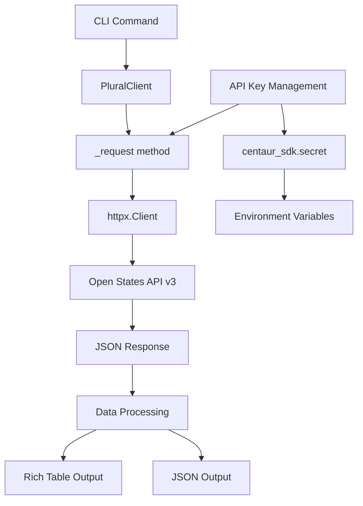

Now I have enough information to write the analysis. Let me create a comprehensive analysis of the plural component.

# Plural Component Analysis

The plural component is a Python library that provides a client interface and CLI for the Open States API v3 (also known as Plural). It enables access to comprehensive US state legislative data including legislation, legislators, committees, and legislative events across all 50 states and territories.

## Architecture

The component follows a **layered architecture** pattern with clear separation of concerns:

1. **Client Layer** (`client.py`): Core HTTP client implementing the Open States API v3 interface
2. **CLI Layer** (`cli.py`): Command-line interface providing user-friendly access to the API
3. **Configuration Layer**: Environment-based configuration with API key management

The architecture emphasizes simplicity and direct API mapping, with the `PluralClient` class serving as a comprehensive wrapper around the Open States REST API endpoints.

## Key Components

### 1. PluralClient Class (client.py:7-355)
The main client class implementing the Open States API v3 interface. Provides methods for accessing jurisdictions, people, bills, committees, and events. Features lazy initialization of HTTP client, automatic API key management through the Centaur SDK, and comprehensive error handling.

### 2. HTTP Request Management (_request method, client.py:29-42)
Centralized request handling with automatic authentication, parameter filtering, and structured error handling. Converts HTTP errors to runtime exceptions with descriptive messages.

### 3. Jurisdictions API (client.py:45-84)
Methods for listing and retrieving jurisdiction data (states, territories, municipalities). Supports filtering by classification and including related data like organizations and legislative sessions.

### 4. People/Legislators API (client.py:87-142)
Search and retrieval of legislator data with support for filtering by jurisdiction, name, role, and district. Includes geolocation-based lookup for finding representatives by latitude/longitude.

### 5. Bills API (client.py:145-243)
Comprehensive bill search and retrieval functionality supporting full-text search, filtering by jurisdiction/session/chamber, sponsor lookup, and date-based queries. Includes both search and direct bill access methods.

### 6. Committees API (client.py:245-287)
Committee listing and detail retrieval with chamber-based filtering and membership information.

### 7. Events API (client.py:290-341)
Legislative event data access for hearings, floor sessions, and other legislative activities with date range filtering and bill association options.

### 8. CLI Commands (cli.py:31-252)
Rich console-based command interface providing table-formatted output for all API endpoints. Supports JSON output mode and comprehensive parameter handling.

## Data Flows



### Primary Data Flow
1. **CLI Invocation**: User executes command with parameters
2. **Client Creation**: PluralClient initialized with optional API key
3. **Request Preparation**: Parameters filtered and formatted for API call
4. **Authentication**: API key retrieved from environment or Centaur SDK
5. **HTTP Request**: GET request to Open States API with authentication headers
6. **Response Processing**: JSON response parsed and error handling applied
7. **Output Formatting**: Data formatted as Rich tables or JSON for display

### Authentication Flow
1. **Key Resolution**: API key from constructor parameter or environment
2. **SDK Integration**: Fallback to centaur_sdk.secret for key management
3. **Header Injection**: X-API-KEY header added to all requests
4. **Error Handling**: Runtime exception if no valid key available

## External Dependencies

### Runtime Libraries

- **httpx** (>=0.27.0) [networking]: Modern HTTP client library providing async/sync support and connection pooling. Used in `PluralClient` for all API communication. Imported in: `client.py`.

- **typer** (>=0.12.0) [cli]: Type-driven CLI framework providing automatic help generation and parameter validation. Powers all CLI commands with rich argument parsing. Imported in: `cli.py`.

- **rich** (>=13.0.0) [cli]: Terminal formatting library providing styled output, tables, and progress indicators. Used for console output and table formatting in CLI commands. Imported in: `cli.py`.

- **python-dotenv** (unlisted) [configuration]: Environment variable loading from .env files. Used for development environment setup. Imported in: `cli.py`.

### Internal Dependencies

- **centaur_sdk.tool_sdk** [configuration]: Provides `secret()` function for secure API key retrieval. Used in: `client.py`.

- **centaur_sdk.cli_tables** [cli]: Provides `Table` class for consistent CLI table formatting across Centaur tools. Used in: `cli.py`.

## API Surface

The component exposes two primary interfaces:

### Python Library Interface

```python
from plural.client import PluralClient

client = PluralClient(api_key="optional")

# Jurisdictions
jurisdictions = client.list_jurisdictions()
california = client.get_jurisdiction("ca")

# Legislators  
legislators = client.search_people(jurisdiction="ca", name="Smith")
local_reps = client.people_by_location(lat=37.7749, lng=-122.4194)

# Bills
bills = client.search_bills(jurisdiction="ca", session="2023", q="climate")
bill = client.get_bill("ca", "2023", "AB 100")

# Committees
committees = client.list_committees("ca", chamber="upper")

# Events
events = client.list_events(jurisdiction="ca", after="2023-01-01")
```

### CLI Interface

```bash
# List jurisdictions
plural jurisdictions --classification state

# Search legislators
plural people --jurisdiction ca --name "Smith"

# Search bills
plural bills --jurisdiction ca --query "climate change" --session 2023

# List committees
plural committees ca --chamber upper

# List events
plural events --jurisdiction ca --after 2023-01-01T00:00:00
```

All CLI commands support `--json` flag for machine-readable output and comprehensive filtering options matching the API capabilities.
