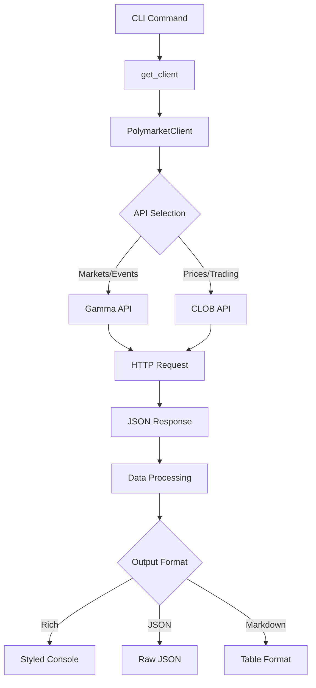

# Polymarket CLI Analysis

The Polymarket CLI is a Python-based command-line tool for interacting with Polymarket prediction markets. It provides comprehensive access to market data, events, prices, and trading information through an intuitive interface.

## Architecture

The component follows a **layered architecture** with clear separation between the API client layer and the CLI interface layer. The design emphasizes modularity and testability:

- **Client Layer**: The `PolymarketClient` class handles all HTTP interactions with Polymarket's APIs
- **CLI Layer**: Typer-based command interface with rich formatting and multiple output options
- **Data Processing**: Utility functions for formatting prices, numbers, and parsing JSON responses

## Key Components

### PolymarketClient Class
The core API client that manages connections to both Polymarket APIs:
- **Gamma API**: Primary market and event data (`gamma-api.polymarket.com`)
- **CLOB API**: Order book and trading data (`clob.polymarket.com`)
- Implements connection pooling via httpx.Client with proper lifecycle management
- Provides unified error handling and response processing

### CLI Command Structure
The CLI exposes 11 distinct commands organized by functionality:

1. **markets**: List active prediction markets with volume filtering
2. **market**: Get detailed information for a specific market
3. **trades**: View recent trades for a market condition
4. **history**: Display price/volume history with time intervals
5. **search**: Search markets by keyword across events
6. **trending**: Show markets ranked by 24-hour volume
7. **events**: List event containers grouping related markets
8. **event**: Get details for a specific event
9. **price**: Get current token price from CLOB
10. **book**: Display orderbook depth for a token
11. **raw**: Make raw API calls for debugging

### Output Formatting System
Multi-format output support with consistent styling:
- **Rich Tables**: Styled console output with colors and formatting
- **JSON**: Raw structured data for programmatic consumption  
- **Markdown**: Tables compatible with documentation systems

### Data Parsing Utilities
Specialized functions for handling Polymarket's data formats:
- Price parsing from JSON arrays with error handling
- Outcome text extraction and validation
- Number formatting with K/M/B suffixes for readability

## Data Flows



The data flow follows a consistent pattern where CLI commands instantiate the client, make API calls through the unified request method, process responses through format-specific handlers, and output results in the requested format.

## External Dependencies

### External Libraries

- **httpx** (>=0.27.0) [networking]: Modern HTTP client library providing async/sync capabilities, connection pooling, and HTTP/2 support. Used throughout the PolymarketClient for all API communications via the `_request` method. Imported in: `tools/crypto/polymarket/client.py`.

- **typer** (>=0.12.0) [cli]: Type-hint based CLI framework that automatically generates command interfaces from function signatures. Provides the `@app.command()` decorators and argument/option parsing for all CLI commands. Imported in: `tools/crypto/polymarket/cli.py`.

- **rich** (>=13.0.0) [cli]: Terminal formatting library providing styled console output, progress bars, and tables. Used via `Console` class for colored output and `Table` class (via centaur_sdk wrapper) for formatted market data display. Imported in: `tools/crypto/polymarket/cli.py`.

- **python-dotenv** (>=1.0.0) [configuration]: Environment variable loading from `.env` files. Listed as dependency but not directly imported in the source files, likely used by the broader centaur framework for configuration management.

## API Surface

The component exposes its functionality through multiple interfaces:

### CLI Commands
All commands support common options:
- `--json`: Output raw JSON for programmatic use
- `--limit/-n`: Control result count (default 20)
- `--markdown/-m`: Generate markdown tables

Market data commands (`markets`, `trending`, `search`) include:
- `--closed`: Include closed/resolved markets
- Volume and price filtering capabilities

### Python API
The PolymarketClient class provides a programmatic interface:

```python
from polymarket.client import PolymarketClient

client = PolymarketClient()
markets = client.list_markets(limit=50, closed=False)
market = client.get_market("market-id")
prices = client.get_price("token-id")
```

### HTTP Integration Points
Direct integration with Polymarket's production APIs:
- **Gamma API**: Market metadata, events, search functionality
- **CLOB API**: Real-time pricing, order books, trade history

## External Systems

The component integrates with Polymarket's prediction market infrastructure:

- **Gamma API** (`gamma-api.polymarket.com`): Provides market metadata, event information, and search capabilities. Used for market discovery and basic information retrieval.

- **CLOB API** (`clob.polymarket.com`): Central limit order book providing real-time pricing, order book depth, trade history, and market microstructure data. Some endpoints require authentication for detailed trade information.

Both APIs use REST over HTTPS with JSON payloads. The client implements proper HTTP error handling and status code management for production reliability.
