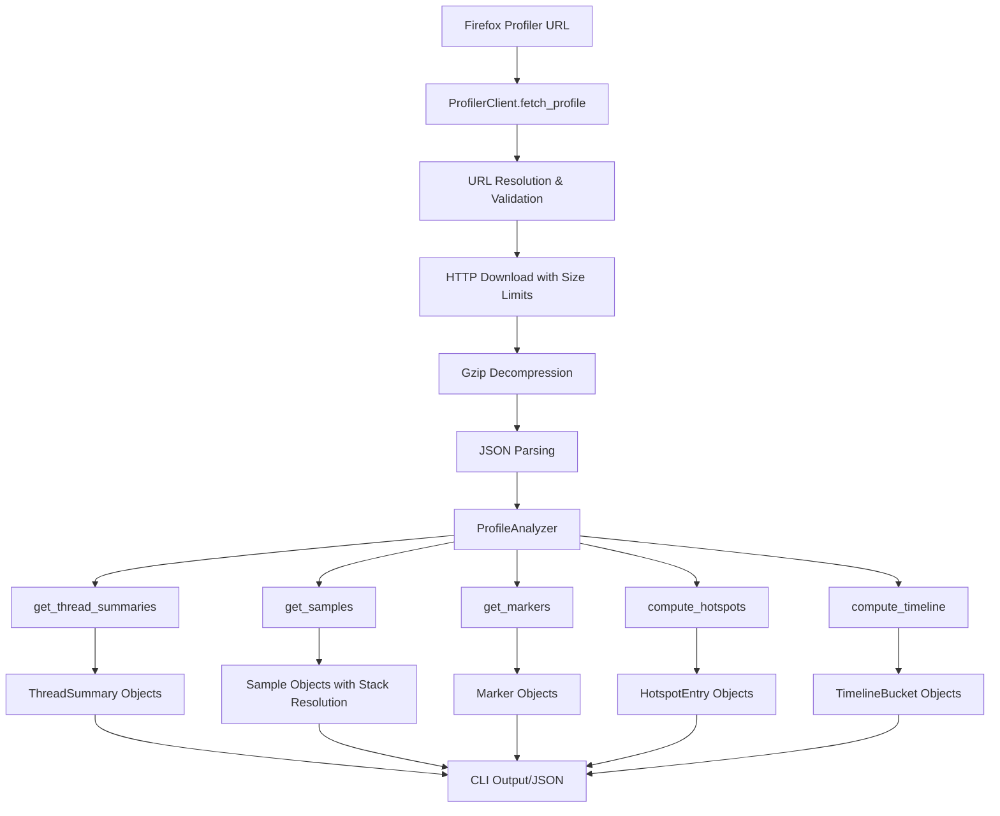

# Profslice Component Analysis

## Architecture

The profslice component implements a layered architecture for Firefox Profiler data extraction and analysis. It follows a clear separation of concerns with three primary layers:

1. **CLI Layer** (`cli.py`): User interface and command orchestration using Typer framework
2. **Client Layer** (`client.py`): HTTP client for fetching profiles from Firefox Profiler services  
3. **Analysis Layer** (`profile.py`): Core data structures and analysis algorithms

The component uses a data-driven approach where Firefox Profiler JSON data is parsed into structured Python dataclasses, then analyzed through various algorithms to extract performance insights. The architecture emphasizes immutable data structures and functional programming patterns for analysis operations.

## Key Components

### ProfilerClient (client.py)
The HTTP client responsible for fetching Firefox Profiler data from multiple sources. It handles URL resolution, content validation, and size limits for safety. Supports fetching from share.firefox.dev, profiler.firefox.com, and Google Cloud Storage endpoints with automatic gzip decompression.

### ProfileAnalyzer (profile.py) 
The core analysis engine that parses Firefox Profiler JSON format and provides methods for extracting samples, markers, computing hotspots, and generating timelines. It handles the complex task of resolving stack traces from indexed tables and provides filtered views of profiling data.

### CLI Commands (cli.py)
Eight main commands provide comprehensive profile analysis capabilities:
- `fetch`: Download profiles from URLs
- `info`: Display profile metadata
- `threads`: List thread summaries
- `samples`: Extract call stack samples
- `markers`: Extract event markers
- `hotspots`: Compute CPU hotspots
- `timeline`: Generate time-bucketed analysis

### Data Models (profile.py)
Five core dataclasses represent different aspects of profiling data:
- `ThreadSummary`: Thread-level statistics
- `Sample`: Individual stack trace samples
- `Marker`: Performance events with timing
- `HotspotEntry`: CPU usage aggregation
- `TimelineBucket`: Time-based analysis buckets

### Time Range Parser (cli.py)
Flexible time range parsing that supports multiple formats including absolute milliseconds, second notation (1s-2s), and duration notation (1s+500ms). This enables precise temporal filtering of profiling data.

## Data Flows

The primary data flow starts with a Firefox Profiler URL being resolved and downloaded by the ProfilerClient. The raw JSON profile data is then passed to ProfileAnalyzer which provides various analysis methods. Each analysis method processes the raw profiling tables (samples, stacks, functions, strings) to produce structured output objects that can be serialized to JSON or displayed via Rich tables.

## External Dependencies

### External Libraries

- **httpx** (>=0.27.0) [networking]: Modern HTTP client library for fetching Firefox Profiler data from remote URLs. Provides async support, connection pooling, and automatic redirect handling. Used extensively in ProfilerClient for downloading profiles from share.firefox.dev, profiler.firefox.com, and storage.googleapis.com. Integrated in: `tools/infra/profslice/client.py`.

- **typer** (>=0.12.0) [cli]: Modern CLI framework built on top of Click that provides type hints and automatic help generation. Used to implement all CLI commands including fetch, threads, samples, markers, hotspots, timeline, and info. Provides argument parsing, option handling, and rich help text. Integrated in: `tools/infra/profslice/cli.py`.

- **rich** (>=13.0.0) [cli]: Rich text and beautiful formatting library for terminal output. Used to create formatted tables for displaying thread summaries and hotspot analysis results. Provides the Console and Table classes for structured terminal output. Integrated in: `tools/infra/profslice/cli.py`.

- **python-dotenv** (>=1.0.0) [config]: Environment variable loader for managing configuration. Loaded at the top of the CLI module to support environment-based configuration, though the current implementation doesn't require API keys. Integrated in: `tools/infra/profslice/cli.py`.

All dependencies are runtime dependencies with no dev-only packages specified. The component uses Python 3.11+ features including union type syntax and dataclass enhancements.

## API Surface

The profslice library exposes its functionality primarily through a command-line interface with eight main commands:

### CLI Commands
- `profslice fetch <url>`: Download Firefox Profiler data from URLs or load local files
- `profslice info <profile>`: Display profile metadata and summary statistics  
- `profslice threads <profile>`: List all threads with sample/marker counts and CPU usage
- `profslice samples <profile>`: Extract call stack samples with optional filtering by thread and time range
- `profslice markers <profile>`: Extract performance markers/events with filtering capabilities
- `profslice hotspots <profile>`: Compute CPU hotspots by function or full stack traces
- `profslice timeline <profile>`: Generate time-bucketed analysis with configurable bucket sizes

### Public Classes (Library Usage)
- `ProfilerClient`: HTTP client for fetching profiles with context manager support
- `ProfileAnalyzer`: Core analysis engine for processing profile data
- Data model classes: `ThreadSummary`, `Sample`, `Marker`, `HotspotEntry`, `TimelineBucket`

### Output Formats
All commands support JSON output via `--json` flag, with some supporting JSONL (line-delimited JSON) via `--jsonl` for streaming processing. The component is designed for both interactive use and programmatic consumption by other tools or LLM analysis workflows.
