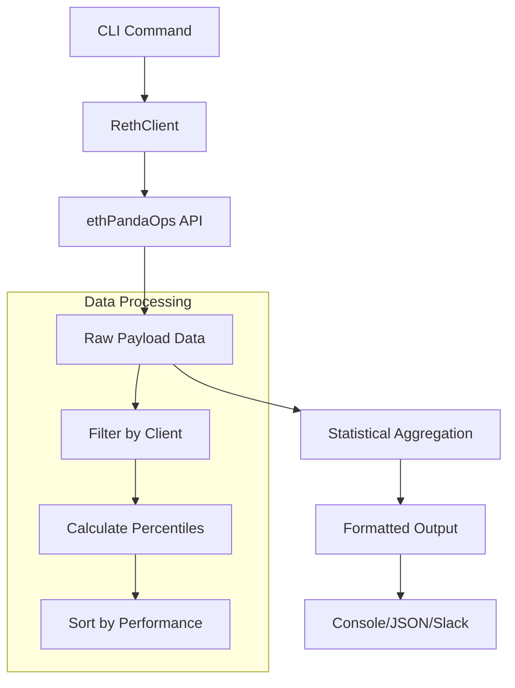

# Reth Component Analysis

The reth component is a Python library that provides a command-line interface for analyzing execution client performance metrics from the ethPandaOps monitoring infrastructure. This tool is specifically designed to monitor and compare Ethereum execution layer (EL) client performance, with a particular focus on tracking Reth's performance relative to other clients like Geth, Nethermind, and Besu.

## Architecture

The component follows a simple client-service architecture pattern with a clear separation of concerns:

- **CLI Layer**: Provides user-facing commands with rich formatting options
- **Client Layer**: Handles API communication with ethPandaOps infrastructure  
- **Data Processing Layer**: Aggregates and analyzes execution timing metrics

The architecture is designed for simplicity and efficiency, focusing on data retrieval, aggregation, and presentation rather than complex business logic.

## Key Components

### RethClient (client.py)
The core API client that interfaces with ethPandaOps monitoring infrastructure. It handles HTTP requests to fetch execution payload timing data and provides statistical aggregation capabilities.

Key methods:
- `get_execution_timings()`: Fetches raw timing data from ethPandaOps API
- `aggregate_timings()`: Computes statistical metrics (avg, percentiles) by client
- `parse_duration()`: Converts human-readable time strings to seconds

### CLI Commands (cli.py)
Two primary commands expose the functionality:

**timings command**: Displays execution timing statistics in a ranked table format, with options for JSON output and Slack-formatted messages. Highlights Reth's performance with special styling.

**slow command**: Identifies and displays the slowest execution payloads above a configurable threshold, useful for performance debugging and outlier analysis.

### Table Presentation
Uses the centaur_sdk Table component for rich console output with color coding and structured formatting.

## Data Flows

The data flow starts with user commands that trigger API requests to ethPandaOps. Raw execution payload data is fetched, aggregated by client implementation, and statistical metrics are calculated. The results are then formatted and presented through various output formats.

## External Dependencies

### External Libraries

- **httpx** (>=0.27.0) [networking]: HTTP client library for making requests to the ethPandaOps API. Provides async/sync HTTP capabilities with timeout handling. Used in `client.py` for all API communication with the ethPandaOps monitoring infrastructure.

- **typer** (>=0.12.0) [cli]: Modern CLI framework that provides argument parsing, command routing, and help generation. Used in `cli.py` to define the command structure with decorators and automatic help text generation.

- **rich** (>=13.0.0) [cli]: Terminal formatting library for colored output, progress bars, and rich text rendering. Used via `rich.console.Console` for colored terminal output and status messages.

- **dotenv** (dev dependency) [configuration]: Loads environment variables from .env files. Called at module import time in `cli.py` to configure the runtime environment.

- **centaur_sdk** (internal): Provides the `Table` class used for structured console output formatting. This appears to be an internal SDK rather than an external dependency.

## API Surface

The component exposes its functionality through two primary interfaces:

### Command Line Interface
- `reth timings [duration] [--json] [--slack]`: Display execution timing statistics
- `reth slow [duration] [--threshold] [--limit]`: Show slow execution payloads

### Python API
- `RethClient`: Main client class for programmatic access
- `get_execution_timings()`: Fetch raw timing data
- `aggregate_timings()`: Statistical analysis functions

The CLI commands provide flexible output formats (table, JSON, Slack) making the tool suitable for both interactive use and integration into monitoring workflows.

### External Systems

The component integrates with:

- **ethPandaOps API** (lab.ethpandaops.io): Public monitoring infrastructure that collects execution client performance metrics from Ethereum mainnet. The component queries the `/api/v1/mainnet/int_engine_new_payload` endpoint to retrieve execution timing data.
