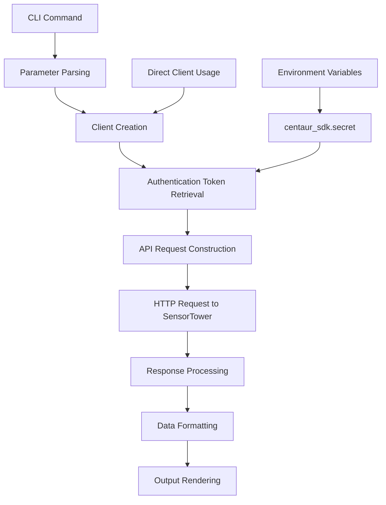

# SensorTower Component Analysis

## Overview

The SensorTower component is a Python library that provides both a client SDK and CLI interface for accessing SensorTower's mobile app analytics API. It enables developers and researchers to query app store data including download estimates, revenue figures, top charts, and publisher information for both iOS and Android platforms.

## Architecture

The component follows a **layered architecture** pattern with clear separation of concerns:

- **Client Layer** (`client.py`): Core API client handling HTTP requests and authentication
- **CLI Layer** (`cli.py`): Command-line interface built on top of the client
- **Configuration Layer**: Environment-based configuration using the centaur SDK

The design emphasizes reusability, with the client being usable both programmatically and through CLI commands.

## Key Components

### 1. SensorTowerClient Class
The primary API client class provides a comprehensive interface to SensorTower's REST API. It handles authentication via auth tokens and supports both iOS and Android platforms.

**Key Methods:**
- `get_sales_estimates()`: Downloads and revenue data for specified apps
- `get_top_charts()`: App rankings in various categories
- `search_apps()`: App search functionality
- `get_publisher()` / `get_publisher_apps()`: Publisher information and app catalogs
- `get_app_info()`: Individual app metadata

### 2. CLI Commands
The CLI provides 7 main commands for different types of analytics queries:

- `downloads`: App download estimates over time
- `revenue`: Revenue estimates with date ranges
- `top-charts`: App store rankings by category
- `publisher`: Publisher information and app listings
- `search`: App search by name or keywords
- `app-lookup`: Direct App Store/Play Store ID lookup
- `raw`: Raw API endpoint access

### 3. Data Formatting Utilities
Helper functions for presenting data in user-friendly formats:
- Number formatting with K/M/B suffixes
- Currency formatting
- Markdown table output
- Rich console tables with styling

### 4. Authentication Management
Integrated with centaur SDK's secret management system, supporting multiple environment variable patterns (`SENSOR_TOWER_AUTH_TOKEN`, `SENSORTOWER_AUTH_TOKEN`).

### 5. Platform Abstraction
Consistent handling of iOS and Android differences through platform normalization and endpoint selection.

## Data Flows



### Request Flow
1. **Input Processing**: CLI arguments or direct method calls are processed and validated
2. **Authentication**: Auth tokens are retrieved from environment via centaur SDK
3. **API Communication**: HTTP requests are made to SensorTower endpoints with proper parameters
4. **Data Processing**: JSON responses are parsed and normalized across platforms
5. **Output Formatting**: Data is formatted for console display, JSON output, or markdown tables

### Error Handling Flow
- HTTP errors are caught and wrapped with descriptive messages
- Missing authentication triggers helpful error messages with token acquisition instructions
- Invalid parameters result in clear CLI error messages with suggestions

## External Dependencies

### External Libraries

- **httpx** (>=0.27.0) [networking]: Modern HTTP client for making API requests to SensorTower. Provides async support, connection pooling, and comprehensive error handling. Used in: `tools/research/sensortower/client.py` for all API communications.

- **typer** (>=0.12.0) [cli]: Modern CLI framework for building command-line interfaces. Provides automatic help generation, type validation, and rich terminal output. Used in: `tools/research/sensortower/cli.py` for all command definitions and argument parsing.

- **rich** (>=13.0.0) [cli]: Rich text and beautiful formatting for terminal output. Provides styled tables, progress bars, and colored console output. Used in: `tools/research/sensortower/cli.py` for table rendering and styled console messages.

### Development Dependencies

- **python-dotenv** [build-tool]: Environment variable loading from `.env` files for development. Used in: `tools/research/sensortower/cli.py` for loading development environment configuration.

### Internal Dependencies

- **centaur_sdk** [internal]: Provides secret management functionality and table utilities. The `secret()` function retrieves authentication tokens from environment variables, while `Table` provides rich table formatting. Used in: `tools/research/sensortower/client.py` (secret management) and `tools/research/sensortower/cli.py` (table rendering).

## API Surface

### Client API (Programmatic Usage)
```python
from sensortower import SensorTowerClient

client = SensorTowerClient()
# Get download estimates
data = client.get_sales_estimates(["123456"], "ios", start_date, end_date)
# Search for apps
apps = client.search_apps("Instagram", "ios", limit=10)
# Get top charts
charts = client.get_top_charts("ios", category="6014", country="US")
```

### CLI API (Command Line Usage)
```bash
# Download estimates
sensortower downloads 123456 --platform ios --start 2024-01-01 --end 2024-01-31

# Revenue data with markdown output
sensortower revenue com.instagram.android --platform android --markdown

# Top charts
sensortower top-charts --platform ios --category 6014 --type grossing --limit 50

# App search
sensortower search "Instagram" --platform ios --json
```

### Configuration Requirements
- `SENSOR_TOWER_AUTH_TOKEN`: Required authentication token from SensorTower account
- Optional `.env` file support for development environments

The component exposes a clean, consistent API for mobile app analytics across both programmatic and command-line interfaces, with comprehensive error handling and flexible output formatting options.
