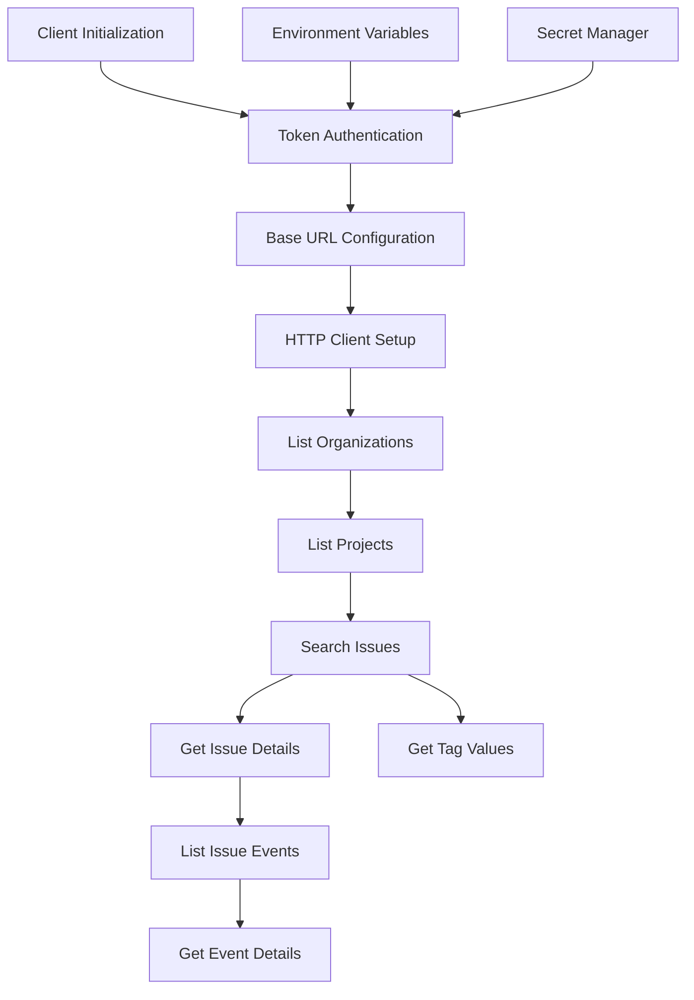

# Sentry Client Library

The sentry component is a Python library that provides a read-only client for the Sentry error tracking platform. It wraps the Sentry REST API to enable browsing issues, events, and related metadata without requiring Sentry's AI-powered search capabilities.

## Architecture

The component follows a simple client-server architecture pattern with a single-class API wrapper design. The `SentryClient` class encapsulates all HTTP communication with the Sentry API, providing a clean abstraction over the underlying REST endpoints. The architecture emphasizes simplicity and ease of use, with minimal configuration requirements and automatic connection management.

## Key Components

The library consists of two primary modules:

### SentryClient Class (`client.py`)
The main API client class that handles authentication, request/response processing, and endpoint access. It manages an internal `httpx.Client` instance for HTTP communication and provides methods for all supported Sentry operations. The client supports both SaaS (sentry.io) and self-hosted Sentry instances through configurable base URLs.

### Authentication System
Built-in authentication handling using Bearer tokens sourced from environment variables or direct configuration. The client integrates with the `centaur_sdk.secret` function for secure token management, falling back to standard environment variable access when needed.

### Navigation Methods
Organization and project discovery endpoints that allow users to enumerate available Sentry resources. These methods provide the slugs needed for subsequent issue-related operations.

### Issue Management API
Core functionality for listing, searching, and retrieving issue details. Supports Sentry's native query syntax for filtering and sorting, with configurable pagination and statistics periods.

### Event Processing
Methods for accessing individual error events within issues, including full stacktraces and breadcrumb data. Supports both specific event retrieval and latest/oldest event shortcuts.

### Tag Analysis
Functionality to retrieve tag value distributions for issues, enabling analysis of error patterns across different dimensions like releases, browsers, or custom tags.

## Data Flows

The primary data flow starts with client initialization, where authentication tokens are retrieved from either the centaur SDK secret manager or environment variables. The client then establishes the base URL for API communication, defaulting to Sentry's SaaS offering. Users typically begin by listing organizations and projects to identify the appropriate scopes for issue searches. Issue queries return summarized results that can be expanded with detailed event data and tag analysis.

## External Dependencies

### External Libraries

- **httpx** (>=0.27.0) [networking]: Modern HTTP client library for Python with async support and automatic connection pooling. Used as the underlying transport layer for all Sentry API communication. The client leverages httpx's built-in timeout handling, redirect following, and request/response processing capabilities. Imported in: `tools/infra/sentry/client.py`.

## API Surface

The library exposes a single public class `SentryClient` with the following interface:

### Initialization
- `__init__(url, auth_token, timeout)` - Configure client with optional URL override, auth token, and request timeout
- Context manager support via `__enter__`/`__exit__` for automatic resource cleanup

### Navigation
- `list_organizations()` - Enumerate accessible Sentry organizations
- `list_projects(organization_slug)` - List projects within an organization

### Issue Operations  
- `list_issues(organization_slug, project_slug, query, sort, stats_period, limit)` - Search issues with native Sentry query syntax
- `get_issue(organization_slug, issue_id)` - Retrieve detailed issue information
- `list_issue_events(organization_slug, issue_id, full, limit)` - List events for an issue
- `get_event(organization_slug, issue_id, event_id)` - Get complete event data including stacktraces

### Tag Analysis
- `get_issue_tag_values(organization_slug, issue_id, tag_key)` - Retrieve tag value distributions

### Resource Management
- `close()` - Explicitly close the HTTP client connection
- `client` property - Access to the underlying httpx.Client instance

The library also provides a factory function `_client()` that creates a default `SentryClient` instance with standard configuration.
