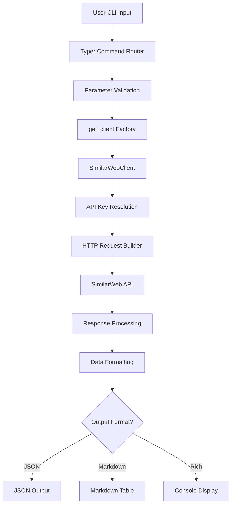
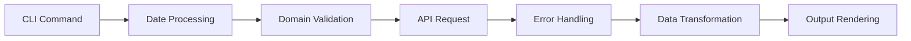

# SimilarWeb CLI Tool

## Architecture

The similarweb component is a command-line interface (CLI) tool that provides access to SimilarWeb's web traffic and market intelligence API. It follows a clean separation of concerns with a client-server architecture pattern where the CLI layer (`cli.py`) handles user interactions and command parsing, while the client layer (`client.py`) manages API communication and data processing.

The architecture is built around the Typer CLI framework, providing a rich command-line experience with multiple subcommands for different types of market intelligence data. The component uses a lazy client instantiation pattern to ensure API credentials are only validated when needed.

## Key Components

1. **SimilarWebClient** (`client.py:26-392`): Core API client class that handles all communication with the SimilarWeb REST API, including authentication, request formatting, and response parsing.

2. **CLI Application** (`cli.py:11`): Main Typer application that orchestrates all CLI commands and provides the primary user interface for the tool.

3. **Traffic Analysis Commands** (`cli.py:69-119`): Command group for website traffic metrics including visits, engagement, and temporal analysis.

4. **Ranking Commands** (`cli.py:122-179`): Commands for retrieving global, country, and industry rankings for domains.

5. **Traffic Sources Analysis** (`cli.py:182-242`): Functionality to analyze traffic distribution across different marketing channels (organic search, paid search, direct, social, etc.).

6. **Geographic Analysis** (`cli.py:245-300`): Commands for understanding traffic distribution by country and region.

7. **Competitive Intelligence** (`cli.py:303-347`): Tools for discovering similar websites and competitor analysis.

8. **Keyword Research** (`cli.py:350-407`): SEO and SEM keyword analysis functionality.

9. **Mobile App Intelligence** (`cli.py:410-466`): Commands for analyzing mobile applications across Google Play and Apple App Store.

10. **Output Formatters** (`cli.py:21-50`): Utility functions for formatting numbers, percentages, and generating different output formats (JSON, markdown, rich tables).

11. **Date Handling** (`cli.py:52-66`): Date parsing and default date range calculation utilities.

12. **Raw API Access** (`cli.py:468-491`): Direct API endpoint access for advanced users and debugging.

## Data Flows

The primary data flow starts with user commands that are parsed by Typer, validated, and then routed to the appropriate client method. The client constructs authenticated HTTP requests to the SimilarWeb API, processes responses, and returns structured data that gets formatted according to user preferences (JSON, markdown tables, or rich console output).

## External Dependencies

### External Libraries

- **httpx** (>=0.27.0) [networking]: Modern async-capable HTTP client for making requests to the SimilarWeb API. Used in `client.py` for all API communication with connection pooling and timeout management. Imported in: `tools/research/similarweb/client.py:6`.

- **typer** (>=0.12.0) [cli]: Modern CLI framework that provides command parsing, argument validation, and help generation. Powers the entire CLI interface with decorators for command definition. Imported in: `tools/research/similarweb/cli.py:6`.

- **rich** (>=13.0.0) [cli]: Rich text and beautiful formatting library for console output. Provides table rendering, colored output, and enhanced console display capabilities. Imported in: `tools/research/similarweb/cli.py:7`.

- **python-dotenv** (>=1.0.0) [build-tool]: Environment variable loading from .env files. Listed as dependency but not directly imported in the codebase - likely used by centaur_sdk for configuration management.

### Internal Dependencies

- **centaur_sdk**: Internal SDK providing `secret()` function for secure credential management and `Table` class for rich table rendering. Imported in: `tools/research/similarweb/client.py:8`, `tools/research/similarweb/cli.py:9`.

## API Surface

The component exposes a comprehensive CLI interface with the following commands:

**Website Analysis Commands:**
- `traffic`: Get website traffic and engagement metrics with date range filtering
- `rank`: Retrieve global, country, and industry rankings for domains  
- `sources`: Analyze traffic distribution by marketing channel
- `geo`: Geographic traffic distribution analysis
- `similar`: Discover competitor and similar websites
- `keywords`: SEO/SEM keyword research and analysis

**Mobile App Commands:**
- `app`: Get mobile application details and metadata
- `app-rank`: Retrieve app store ranking information

**Utility Commands:**
- `raw`: Direct API endpoint access for advanced usage

Each command supports multiple output formats (JSON, markdown, rich console) and includes comprehensive parameter validation and error handling. The CLI provides consistent date parsing, number formatting, and user-friendly error messages across all commands.
