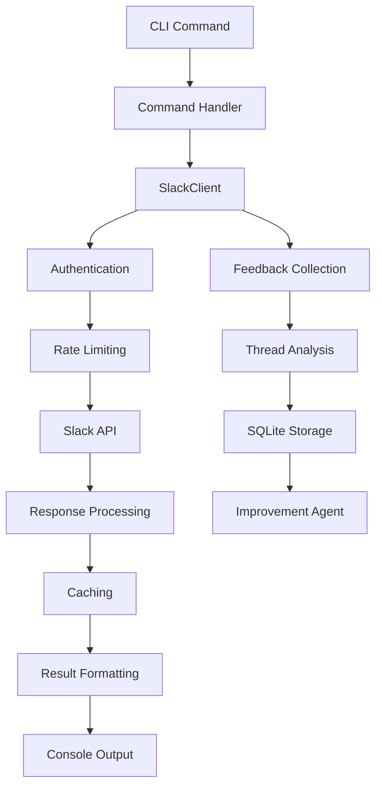

Now I have a comprehensive understanding. Let me provide the full analysis:

# Slack Component Analysis

The `slack` component is a comprehensive command-line interface (CLI) tool for interacting with Slack workspaces. It provides extensive functionality for searching messages, managing channels, sending messages, uploading files, and analyzing bot interaction feedback. The component serves as both an interactive tool for users and an automated feedback collection system for improving AI agent behaviors.

## Architecture

The component follows a **layered architecture** with clear separation of concerns:

- **CLI Layer** (`cli.py`): Typer-based command interface with rich console formatting
- **Client Layer** (`client.py`): Slack API abstraction with authentication, caching, and error handling
- **Feedback System** (`feedback.py`): Automated analysis of bot interactions for continuous improvement
- **Integration Layer**: Centaur SDK integration for tool context and secret management

The architecture emphasizes robust error handling, rate limiting, and caching to provide a reliable interface to the Slack API while minimizing API calls through intelligent caching strategies.

## Key Components

### SlackClient Class
**Location**: `client.py:72-2067`  
The core API client that handles all Slack Web API interactions. Features comprehensive authentication management, rate limiting with exponential backoff, and intelligent caching of channels and users. Supports both bot tokens and optional search tokens for different access patterns.

### Command Interface
**Location**: `cli.py:12-1128`  
Typer-based CLI application providing 20+ commands for Slack operations. Commands are organized into functional groups: messaging, searching, channel management, user management, file operations, and feedback analysis.

### Message Search System
**Location**: `client.py:615-858`  
Dual-mode search implementation that attempts native Slack search first, then falls back to local channel scanning. Supports Slack search modifiers (`in:#channel`, `from:@user`) and provides relevance-based ranking of results.

### Feedback Collection Engine
**Location**: `feedback.py:74-1041`  
Automated system that analyzes Slack threads containing bot interactions to identify issues, classify problems, and generate actionable improvement recommendations. Uses SQLite for persistence and integrates with the Centaur agent system for automated improvements.

### Channel History Management
**Location**: `client.py:859-1107`  
Sophisticated pagination and synchronization system for channel history with cursor-based pagination, timestamp boundaries, and incremental sync capabilities suitable for ETL operations.

### File Upload/Download System
**Location**: `client.py:1561-1951`  
Complete file management system supporting upload, download, and sharing of files to Slack channels with base64 encoding, MIME type detection, and progress tracking.

### User and Channel Management
**Location**: `client.py:1108-1372`  
Comprehensive workspace introspection capabilities including user lookups, channel membership management, and usergroup operations with caching to minimize API overhead.

### Authentication and Rate Limiting
**Location**: `client.py:134-251`  
Structured error handling for authentication failures and rate limits with exponential backoff, retry mechanisms, and proper error propagation for tool orchestration.

## Data Flows

### Message Search Flow
1. **Query Processing**: Parse search query and extract Slack modifiers
2. **Authentication Check**: Verify token availability and permissions
3. **Native Search Attempt**: Try Slack's search.messages API if search token available
4. **Fallback Strategy**: Use local channel scanning if native search fails
5. **Result Ranking**: Score matches by relevance and return sorted results

### Feedback Analysis Flow
1. **Thread Collection**: Scan bot-accessible channels for interactions
2. **Signal Extraction**: Analyze reactions, keywords, and user patterns
3. **Classification**: Categorize feedback as bugs, missing features, or successes
4. **Storage**: Persist structured feedback items in SQLite database
5. **Improvement Dispatch**: Generate prompts and trigger automated agent runs

## External Dependencies

### External Libraries

- **slack-sdk** (>=3.27.0) [api-client]: Official Slack Python SDK providing WebClient for API interactions, error handling, and authentication. Used throughout `client.py` for all Slack API calls including `conversations_history`, `chat_postMessage`, `search_messages`, and file operations.

- **typer** (>=0.12.0) [cli]: Modern CLI framework for building command-line interfaces with automatic help generation and type validation. Powers the entire CLI interface in `cli.py` with decorators like `@app.command()` and automatic argument parsing.

- **python-dotenv** (>=1.0.0) [configuration]: Loads environment variables from `.env` files for development convenience. Used in `cli.py:6` via `load_dotenv()` to configure API tokens and settings.

- **rich** (>=13.0.0) [formatting]: Terminal formatting library providing tables, progress bars, and styled console output. Used extensively in `cli.py` for `Table` rendering, colored output with `console.print()`, and error formatting with styled text.

- **structlog** (>=24.4.0) [logging]: Structured logging library that outputs JSON-formatted log entries. Used in `client.py:25` via `structlog.get_logger()` to provide consistent logging format compatible with the tool-server pipeline.

## API Surface

### Core Commands

- **search**: Search messages across channels with filtering and ranking
- **send**: Send messages to channels with optional threading
- **channel**: Get channel history with pagination and time boundaries  
- **thread**: Retrieve thread replies with full conversation context
- **upload**: Upload files to channels with metadata and sharing
- **channels**: List workspace channels with member counts and purposes
- **users**: Search and list workspace members with profile details

### Feedback Commands

- **feedback collect**: Scan channels for bot interaction feedback
- **feedback digest**: Generate markdown summaries of collected feedback
- **feedback improve**: Automatically dispatch improvement agents based on feedback
- **feedback loop**: Continuously monitor and improve bot behavior

### File Operations

- **files**: List and download message attachments
- **search-files**: Search workspace files by content and metadata
- **dump**: Export complete channel conversations with threading

### Advanced Features

- **sync-history**: Incremental channel synchronization for ETL pipelines
- **usergroups**: Manage Slack user groups and memberships
- **channel-members**: Export channel member lists and email addresses

## External Systems

### Slack Web API
The component integrates deeply with Slack's Web API using both bot tokens (for interactive operations) and optional user tokens (for enhanced search capabilities). Requires `channels:read`, `chat:write`, `files:read`, `files:write`, and `users:read` scopes.

### Centaur Agent Platform
Integrates with the Centaur agent execution platform to dispatch automated improvement runs based on collected feedback. Uses the `/agent/spawn`, `/agent/message`, and `/agent/execute` endpoints for background task orchestration.

### File System
Uses local caching in `~/.cache/paradigm-slack/` for channel lists, user mappings, and feedback database storage to minimize API calls and provide offline capabilities.

## Component Interactions

### Centaur SDK Integration
Uses `centaur_sdk.tool_sdk` for secret management (`SLACK_BOT_TOKEN`, `SLACK_SEARCH_TOKEN`), tool context access for thread-aware operations, and attachment handling for file operations.

### SQLite Database
Maintains local SQLite database at `~/.cache/paradigm-slack/feedback.db` for persistent feedback tracking, improvement analytics, and incremental processing state.

### HTTP Services
Makes direct HTTP requests to the Centaur API for agent orchestration and file download operations using Python's `urllib.request` module with proper authentication headers.
