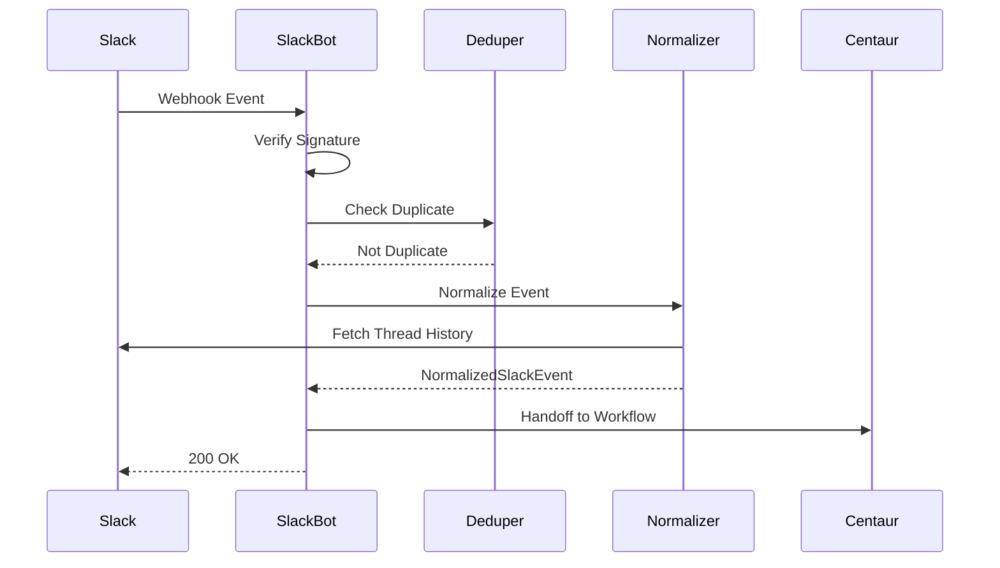
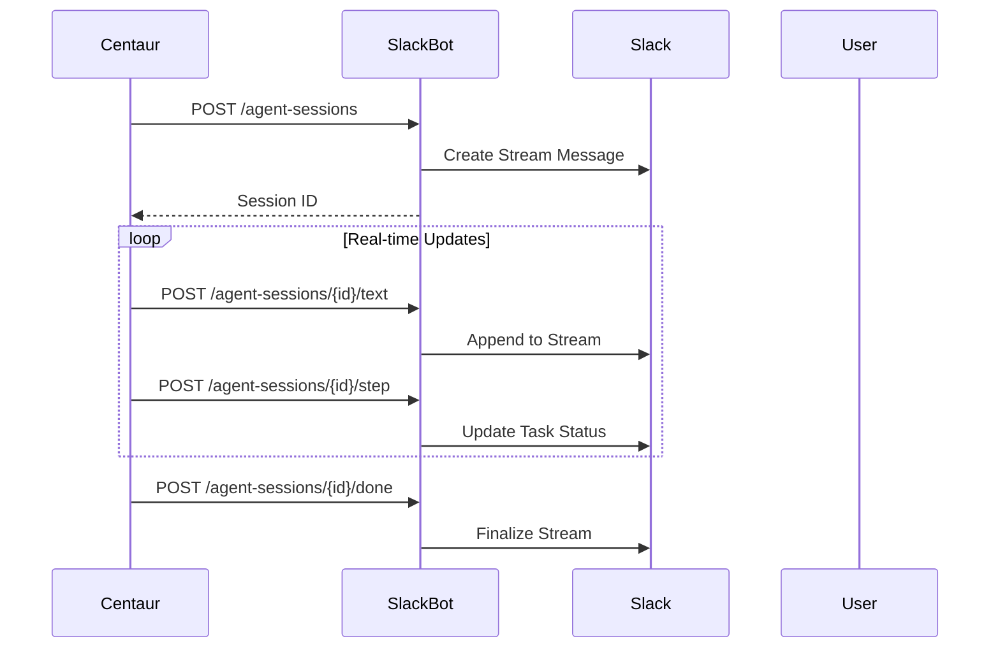
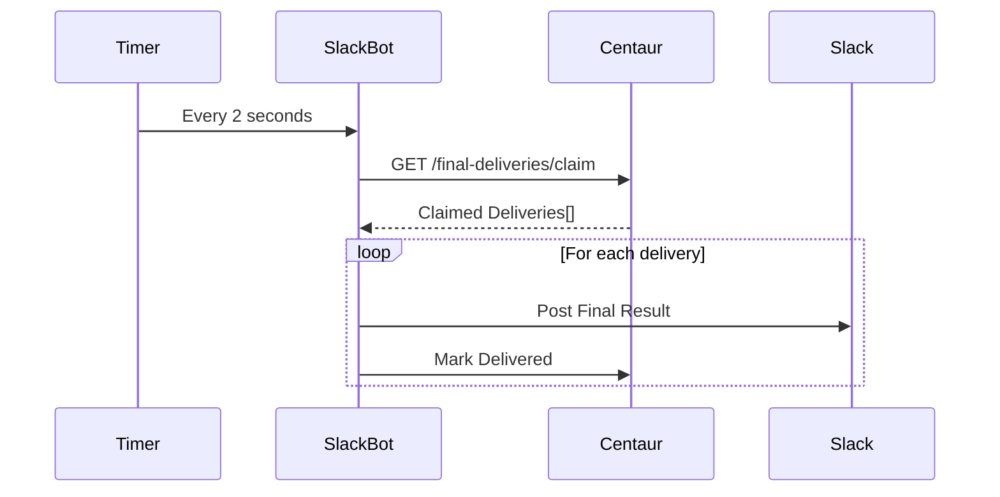

Now let me analyze the project structure and create the comprehensive analysis:

# Slackbot Service Analysis

## Architecture

The slackbot service is a TypeScript-based Slack bot service built with the Hono web framework that serves as a bridge between Slack workspace events and the Centaur AI platform. The architecture follows an event-driven pattern with webhook-based integrations:

- **Event Processing Pipeline**: Receives Slack events via webhooks, normalizes them, deduplicates, and hands off to Centaur workflows
- **API Gateway Pattern**: Provides REST endpoints for Slack message operations, agent sessions, and streaming
- **Session Management**: Manages real-time agent execution sessions with streaming text and task updates
- **Final Delivery System**: Polls Centaur for completed workflows and delivers results back to Slack

The service uses a modular architecture with clear separation between Slack-specific logic, Centaur integration, and core utilities.

## Key Components

### 1. **Main Application (`src/index.ts`)**
The central Hono application that defines all HTTP routes, middleware, and request handlers. Handles Slack webhook events, API endpoints for message operations, agent sessions, and Linear feedback integration.

### 2. **Event Normalization (`src/slack/normalize.ts`)**  
Transforms raw Slack events into standardized `NormalizedSlackEvent` objects. Handles message parsing, mention detection, file processing, and thread history collection for context.

### 3. **Centaur Handoff (`src/centaur/handoff.ts`)**
Orchestrates communication with the Centaur API by sending normalized Slack events as workflow trigger requests. Handles authentication, tracing, and error responses.

### 4. **Agent Session Renderer (`src/slack/agent-session.ts`)**
Manages interactive agent execution sessions in Slack with real-time streaming capabilities. Renders execution plans, task updates, and maintains session state across multiple message updates.

### 5. **Final Delivery Poller (`src/centaur/final-delivery.ts`)**  
Background service that polls Centaur for completed workflow results and delivers them back to Slack channels. Handles chunking, error recovery, and delivery confirmation.

### 6. **Event Deduplication (`src/slack/dedup.ts`)**
In-memory TTL-based deduplication system to prevent processing duplicate Slack webhook events, which can occur due to network retries or Slack's delivery guarantees.

### 7. **Slack Installation Management (`src/slack/installations.ts`)**
Manages Slack app installations and bot tokens. Provides a resolver pattern for obtaining authenticated Slack WebClient instances based on team/enterprise IDs.

### 8. **Configuration (`src/config.ts`)**
Zod-based configuration schema that validates and parses environment variables for Slack credentials, API keys, URLs, and feature flags.

### 9. **Signature Verification (`src/slack/signature.ts`)**  
Implements Slack's webhook signature verification using HMAC-SHA256 to ensure requests are authentic and not tampered with.

### 10. **OpenTelemetry Integration (`src/otel.ts`)**
Comprehensive distributed tracing setup with OTLP export, span management, and trace header propagation for observability across the system.

### 11. **Message Rendering (`src/slack/render.ts`)**
Converts markdown content to Slack's block format with proper chunking, length limits, and fallback text generation for message display.

### 12. **Logging (`src/logging.ts`)**
Security-focused logging system with automatic PII redaction (emails, phones, SSNs, tokens) and structured JSON output for monitoring.

## Data Flows

### Slack Event Processing Flow

### Agent Session Streaming Flow

### Final Delivery Polling Flow

## External Dependencies

### Runtime Dependencies

- **hono** (^4.12.18) [web-framework]: Fast, lightweight web framework for building HTTP APIs. Used as the main application server handling all routes, middleware, and request/response processing. Imported in: `src/index.ts`.

- **@slack/web-api** (^7.15.2) [slack-sdk]: Official Slack Web API client for Node.js. Provides WebClient class for making authenticated Slack API calls including posting messages, updating streams, and fetching conversation data. Imported in: `src/slack/installations.ts`, `src/slack/agent-session.ts`, `src/centaur/final-delivery.ts`.

- **@slack/types** (^2.19.0) [slack-sdk]: TypeScript type definitions for Slack's API objects and block kit elements. Provides type safety for message blocks, chunks, and API responses. Imported in: `src/slack/types.ts`, `src/slack/agent-session.ts`, `src/index.ts`.

- **zod** (^4.4.3) [validation]: TypeScript-first schema validation library. Used for parsing and validating environment configuration with automatic type inference and transformation. Imported in: `src/config.ts`.

- **@std/ulid** (npm:@jsr/std__ulid) [id-generation]: Universally Unique Lexicographically Sortable Identifier generation. Used for creating unique session IDs and request IDs. Imported in: `src/index.ts`, `src/slack/agent-session.ts`.

- **@opentelemetry/api** (^1.9.1) [observability]: OpenTelemetry API for distributed tracing. Provides span creation, context propagation, and trace instrumentation. Imported in: `src/otel.ts`.

- **@opentelemetry/exporter-trace-otlp-proto** (^0.218.0) [observability]: OTLP protocol trace exporter for sending telemetry data to observability backends. Used in OTEL configuration. Imported in: `src/otel.ts`.

- **@opentelemetry/resources** (^2.7.1) [observability]: Resource detection and attribution for telemetry data. Imported in: `src/otel.ts`.

- **@opentelemetry/sdk-trace-base** (^2.7.1) [observability]: Base trace SDK for span processing and sampling. Imported in: `src/otel.ts`.

- **@opentelemetry/sdk-trace-node** (^2.7.1) [observability]: Node.js-specific trace SDK with automatic instrumentation. Imported in: `src/otel.ts`.

- **@opentelemetry/semantic-conventions** (^1.41.1) [observability]: Standard attribute names and values for telemetry data. Imported in: `src/otel.ts`.

### Development Dependencies

- **@types/bun** (^1.3.13) [build-tool]: TypeScript definitions for Bun runtime APIs and globals.

- **@types/node** (^25.7.0) [build-tool]: TypeScript definitions for Node.js built-in modules used for crypto operations.

- **typescript** (^6.0.3) [build-tool]: TypeScript compiler for type checking and transpilation.

- **@total-typescript/ts-reset** (^0.6.1) [build-tool]: Improves TypeScript's built-in types with better defaults.

- **emulate** (^0.5.0) [testing]: Test framework for integration testing with Slack API mocking.

- **oxfmt** (^0.49.0) [build-tool]: Fast code formatter for TypeScript/JavaScript.

- **oxlint** (^1.64.0) [build-tool]: Fast linter with TypeScript support and type-aware rules.

## API Surface

### Slack Webhook Endpoints
- **POST** `/api/slack/events` - Handles Slack event callbacks (messages, mentions, etc.)
- **POST** `/api/slack/actions` - Processes Slack interactive component actions  
- **POST** `/api/slack/options` - Handles dynamic option loading for select menus
- **POST** `/api/slack/commands` - Processes slash commands for Linear feedback integration
- **POST** `/api/webhooks/slack` - Alternative webhook endpoint for Slack events

### Slack Message API
- **POST** `/api/slack/messages` - Posts new messages to Slack channels
- **PATCH** `/api/slack/messages` - Updates existing Slack messages  
- **DELETE** `/api/slack/messages` - Deletes Slack messages
- **GET** `/api/slack/conversations/replies` - Retrieves thread conversation history

### Streaming API
- **POST** `/api/slack/streams/start` - Initiates a new streaming message
- **POST** `/api/slack/streams/append` - Appends content to an active stream
- **POST** `/api/slack/streams/stop` - Finalizes and stops a stream

### Agent Session API  
- **POST** `/api/slack/agent-sessions` - Creates new agent execution sessions
- **POST** `/api/slack/agent-sessions/{id}/text` - Streams markdown text to sessions
- **POST** `/api/slack/agent-sessions/{id}/step` - Updates execution step status
- **POST** `/api/slack/agent-sessions/{id}/done` - Marks sessions as complete
- **POST** `/api/slack/agent-sessions/{id}/harness-event` - Processes harness events

### Assistant API
- **POST** `/api/slack/assistant/status` - Updates assistant thread status
- **POST** `/api/slack/assistant/title` - Sets assistant thread title

### Health Endpoints
- **GET** `/health` - Basic health check returning service status
- **GET** `/health/ready` - Readiness probe (redirects to `/health`)

## External Systems

The slackbot service integrates with several external systems at runtime:

### Slack API
- **Workspace Integration**: Connects to Slack workspaces via bot tokens for posting messages, managing threads, and receiving events
- **Real-time Streaming**: Uses Slack's streaming message API for live agent session updates
- **Webhook Delivery**: Receives event notifications from Slack via signed webhooks

### Centaur API Platform  
- **Workflow Orchestration**: Sends normalized Slack events to trigger AI agent workflows via `/workflows/runs`
- **Final Delivery Polling**: Continuously polls `/agent/final-deliveries/claim` for completed workflow results
- **Session Management**: Reports delivery status via `/agent/final-deliveries/{id}/delivered` and `/agent/final-deliveries/{id}/failed`

### Linear API
- **Issue Creation**: Creates feedback issues via GraphQL mutations when users submit slash commands
- **Project Integration**: Routes issues to configured Linear teams and projects based on environment configuration

### OpenTelemetry Backend
- **Distributed Tracing**: Exports telemetry data via OTLP protocol to observability platforms
- **Performance Monitoring**: Tracks request flows, external API calls, and error rates across the system

## Component Interactions

The slackbot service primarily serves as a bridge component and does not directly call other components in the centaur-src codebase. Instead, it integrates with external systems:

- **HTTP API Calls**: Makes authenticated requests to the Centaur API for workflow triggering and result polling
- **Webhook Processing**: Receives and processes events from Slack's Event API
- **Database Independence**: Maintains no persistent state, relying on external systems for data storage
- **Session State**: Uses in-memory maps for temporary session management with TTL-based cleanup
