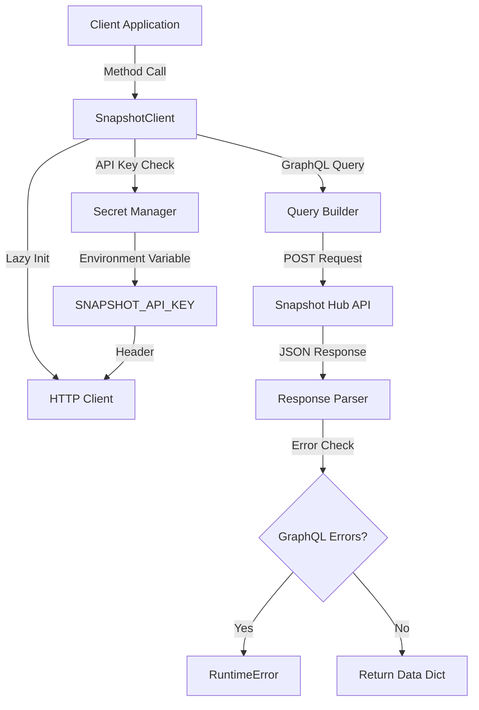

# Snapshot Component Analysis

The snapshot component is a Python library that provides a GraphQL client for interacting with the Snapshot governance platform. It enables off-chain governance voting, proposal management, and space exploration through a clean API wrapper around Snapshot's GraphQL endpoint.

## Architecture

The component follows a simple client-wrapper architecture pattern with a single main class `SnapshotClient` that encapsulates all interactions with the Snapshot Hub GraphQL API. The design emphasizes simplicity and ease of use while providing comprehensive access to governance data.

The architecture is built around:
- A stateful HTTP client with optional API key authentication
- GraphQL query execution with error handling
- Context manager support for resource cleanup
- Lazy initialization of the HTTP client

## Key Components

### SnapshotClient Class
The primary interface for all Snapshot API interactions, providing methods for spaces, proposals, votes, and voting power queries. It manages HTTP client lifecycle and authentication headers.

### GraphQL Query Methods
- **get_space()**: Retrieves detailed information about a governance space
- **list_spaces()**: Queries multiple spaces with sorting and pagination
- **get_proposal()**: Fetches complete proposal data including voting results
- **list_proposals()**: Lists proposals for a space with optional state filtering
- **get_votes()**: Retrieves vote records for a specific proposal
- **get_voting_power()**: Calculates voting power for a voter in a specific context

### Authentication System
Optional API key support for higher rate limits, with fallback to environment variable configuration through the centaur_sdk secret management.

### HTTP Client Management
Lazy-loaded httpx.Client with timeout configuration and proper resource cleanup via context manager pattern.

## Data Flows



The data flow follows a request-response pattern where:
1. Client methods construct GraphQL queries with variables
2. HTTP client executes POST requests to hub.snapshot.org/graphql
3. Responses are parsed and validated for GraphQL errors
4. Clean data dictionaries are returned to callers

## External Dependencies

### External Libraries

- **httpx** (>=0.27.0) [networking]: Modern HTTP client library providing sync/async support. Used for all GraphQL API requests to Snapshot Hub. Provides timeout handling, connection pooling, and automatic JSON serialization. Imported in: `client.py`.

- **typer** (>=0.12.0) [cli]: Command-line interface creation library. Listed as dependency but not used in current implementation, likely reserved for future CLI functionality.

- **rich** (>=13.0.0) [cli]: Terminal formatting and display library. Listed as dependency but not used in current implementation, likely intended for future CLI output formatting.

- **python-dotenv** (>=1.0.0) [configuration]: Environment variable loading from .env files. Not directly imported but may be used by the centaur_sdk secret management system for configuration loading.

### Internal Dependencies

- **centaur_sdk** [secret management]: Internal SDK providing the `secret()` function for secure environment variable access. Used for SNAPSHOT_API_KEY retrieval with fallback support.

## API Surface

The component exposes a clean public API through the `SnapshotClient` class:

### Constructor
```python
SnapshotClient(api_key: str | None = None, timeout: float = 30.0)
```

### Core Methods
- `get_space(space_id: str) -> dict`: Single space retrieval
- `list_spaces(first: int = 20, order_by: str = "created", order_direction: str = "desc") -> list[dict]`: Space listing with pagination
- `get_proposal(proposal_id: str) -> dict`: Proposal details
- `list_proposals(space: str, state: str | None = None, first: int = 20) -> list[dict]`: Proposal listing with filtering
- `get_votes(proposal_id: str, first: int = 1000) -> list[dict]`: Vote records
- `get_voting_power(voter: str, space: str, proposal: str) -> dict`: Voting power calculation

### Resource Management
- Context manager support (`__enter__`/`__exit__`)
- Explicit `close()` method for cleanup

### Factory Function
- `_client() -> SnapshotClient`: Convenience factory using environment configuration

The API is designed for both standalone usage and integration into larger governance analysis workflows, with consistent return types and comprehensive error handling.
