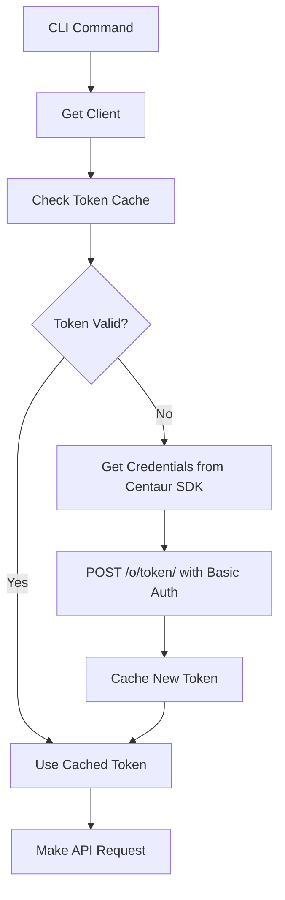
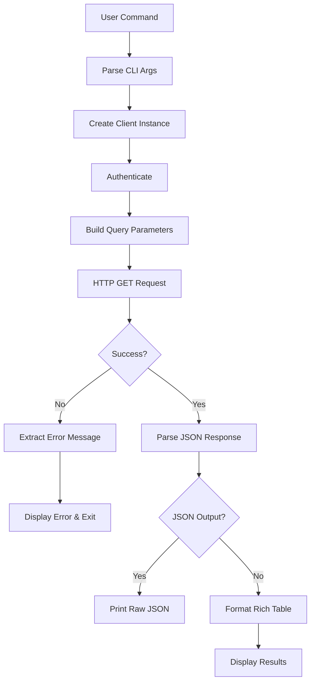
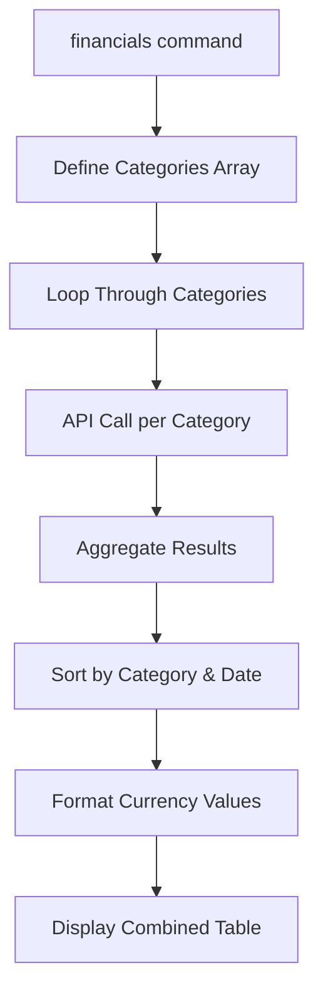

Now I have enough information to provide a comprehensive analysis. Let me write the analysis:

# Standard Metrics Component Analysis

## Overview

The **standard-metrics** component is a Python library that provides both a CLI tool and an API client for interfacing with the Standard Metrics portfolio analytics service. This component serves as a bridge for accessing portfolio company data, financial metrics, and documents through Standard Metrics' REST API using OAuth2 client credentials authentication.

## Architecture

The component follows a **layered architecture pattern** with clear separation of concerns:

1. **CLI Layer** (`cli.py`) - User interface with rich table formatting and JSON output options
2. **Client Layer** (`client.py`) - HTTP client with OAuth2 authentication and API abstraction
3. **Configuration Layer** - Environment-based configuration using the Centaur SDK

The design emphasizes simplicity and direct API mapping, with each CLI command corresponding closely to a client method that wraps a specific Standard Metrics API endpoint.

## Key Components

### 1. StandardMetricsClient Class
**Location**: `client.py:14-208`  
**Purpose**: Core API client providing OAuth2-authenticated HTTP requests to Standard Metrics API

Key responsibilities:
- OAuth2 client credentials authentication with token caching
- Base HTTP client configuration with proper headers and timeouts
- Error handling and response parsing
- API endpoint abstraction for portfolio data access

### 2. CLI Command Set
**Location**: `cli.py:23-301`  
**Purpose**: Typer-based CLI providing user-friendly commands for data access

Commands include:
- `companies` - List and filter portfolio companies
- `company` - Get detailed company information
- `metrics` - Retrieve company performance metrics with filtering
- `financials` - Specialized financial metrics aggregation
- `documents` - List company documents and reports
- `funds` - List available funds
- `raw` - Direct API endpoint access for advanced users

### 3. Authentication System
**Location**: `client.py:28-68`  
**Purpose**: OAuth2 client credentials flow with automatic token refresh

Features:
- Credential retrieval from Centaur SDK secrets
- Token caching with expiration handling
- Basic authentication header encoding
- Comprehensive error messaging for credential issues

### 4. Rich Console Output
**Location**: `cli.py:42-274`  
**Purpose**: Formatted table output using Rich library for improved readability

Provides:
- Tabular display of companies, metrics, and documents
- Financial value formatting (K/M suffixes)
- JSON output option for programmatic use
- Color-coded status indicators

## Data Flows

### Authentication Flow

### Data Retrieval Flow

### Financial Metrics Aggregation

## External Dependencies

### Runtime Libraries

- **httpx** (>=0.27.0) [networking]: Modern async-capable HTTP client used for all API communications. Provides connection pooling, timeout handling, and redirect following. Used extensively in `client.py` for OAuth token requests and Standard Metrics API calls.

- **typer** (>=0.12.0) [cli]: Modern CLI framework built on Click that provides type hints, automatic help generation, and option parsing. Used in `cli.py` to define all commands, arguments, and options with rich type annotations.

- **rich** (>=13.0.0) [cli]: Terminal formatting library for creating rich text and beautiful tables. Used in `cli.py` for console output, table formatting, and color-coded status displays.

### Internal Dependencies

- **centaur_sdk.tool_sdk** [internal]: Provides the `secret()` function for secure credential retrieval from environment variables. Used in `client.py:30-31` for OAuth credential access.

- **centaur_sdk.cli_tables** [internal]: Provides enhanced table formatting capabilities. Used in `cli.py:11` as the `Table` class for structured output display.

- **python-dotenv** [config]: Environment variable loading from `.env` files. Used in `cli.py:5-7` for development configuration.

### Build System

- **hatchling** [build-tool]: Modern Python build backend for packaging. Specified in `pyproject.toml:13-14` as the build system.

## API Surface

### Client API
The `StandardMetricsClient` class exposes the following public methods:

- `list_companies(page, page_size, name, ids)` - Paginated company listing with filtering
- `get_company(company_id)` - Single company retrieval by ID
- `get_metrics(company_id, company_slug, category, from_date, to_date, cadence, page, page_size)` - Flexible metrics querying
- `get_documents(company_id, parse_state, source, from_date, to_date, page, page_size)` - Document listing and filtering
- `get_budgets(company_id, page, page_size)` - Budget data access
- `get_funds(page, page_size)` - Fund listing
- `get_notes(company_id, page, page_size)` - Company notes retrieval
- `raw_request(method, endpoint, params)` - Direct API access

### CLI Commands
Seven main commands available via the `standard-metrics` CLI:

1. **companies** - List portfolio companies with name filtering and pagination
2. **company** - Display detailed company information
3. **metrics** - Query company metrics with category, date, and cadence filters
4. **financials** - Aggregate financial metrics (revenue, burn, runway, etc.)
5. **documents** - List company documents with source and state filters
6. **funds** - Display available funds
7. **raw** - Make direct API calls for advanced usage

All commands support `--json` output for programmatic consumption and `--limit` for result pagination.

## External Systems

### Standard Metrics API
- **Base URL**: https://api.standardmetrics.io/v1
- **Authentication**: OAuth2 client credentials flow
- **Token Endpoint**: https://api.standardmetrics.io/o/token/
- **Protocol**: REST over HTTPS
- **Data Format**: JSON

The component integrates with Standard Metrics' portfolio analytics platform to provide access to:
- Portfolio company information and metadata
- Financial and operational metrics with time series data
- Document management and parsing status
- Fund and investment data
- Budget and forecasting information

### Configuration Requirements
- **STANDARD_METRICS_CLIENT_ID**: OAuth2 client identifier
- **STANDARD_METRICS_CLIENT_SECRET**: OAuth2 client secret

These credentials must be obtained from the Standard Metrics developer console and configured in the Centaur environment.
