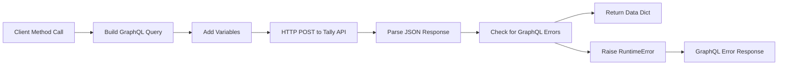
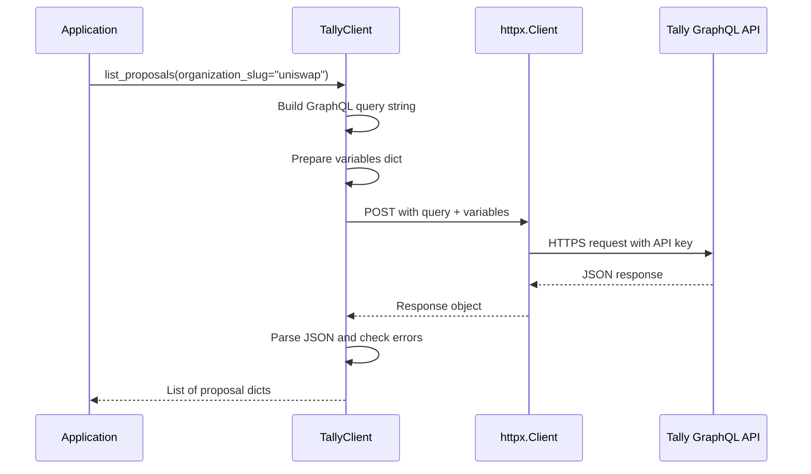

Now I have enough information to analyze the component. Let me create the analysis.

# Tally Component Analysis

## Overview

The Tally component is a Python library that provides a client for interacting with the Tally governance API. Tally is a platform for on-chain governance that tracks proposals, voting, and delegate information across various DAOs and governance protocols. This component wraps Tally's GraphQL API to provide a convenient Python interface for querying governance data.

## Architecture

The component follows a simple client-wrapper pattern with a single-class architecture. The `TallyClient` class encapsulates all interactions with the Tally GraphQL API, providing a high-level Python interface for governance data queries. The design emphasizes simplicity and ease of use, with methods that correspond directly to common governance queries.

The architecture is stateless except for the HTTP client connection pooling, making it safe to use across different contexts. The client uses lazy initialization for the underlying HTTP client and provides proper resource cleanup through context manager protocols.

## Key Components

### TallyClient Class
The main and only public interface of the component. Located in `client.py`, it provides methods for querying organizations, governors, proposals, and delegates from the Tally API.

**Key Methods:**
- `list_organizations()` - Lists governance organizations with metadata
- `get_organization()` - Retrieves a single organization by slug
- `list_governors()` - Lists governors, optionally filtered by organization
- `list_proposals()` - Lists governance proposals with filtering options
- `get_proposal()` - Retrieves a single proposal by ID
- `list_delegates()` - Lists delegates for an organization with sorting options

### GraphQL Query Layer
The component uses embedded GraphQL queries for each API operation. These queries are defined as multi-line strings within each method and include comprehensive field selections for governance entities.

### HTTP Client Management
Uses `httpx.Client` with lazy initialization and proper resource management through context manager protocols. The client handles API key authentication and error handling for GraphQL responses.

### Secret Management Integration
Integrates with the centaur-sdk's secret management system to securely handle the Tally API key, supporting both explicit key passing and environment variable resolution.

## Data Flows

The component implements a straightforward request-response pattern for all operations:



The data flow for a typical query operation:



## External Dependencies

### External Libraries

- **httpx** (>=0.27.0) [networking]: Modern HTTP client library for Python with async support. Used for making authenticated requests to the Tally GraphQL API. Provides connection pooling, timeout management, and proper HTTP error handling. Imported in: `client.py` line 4.

- **typer** (>=0.12.0) [cli]: Command-line interface creation library. Listed as a dependency but not used in the current codebase - likely intended for future CLI functionality. No current integration points found.

- **rich** (>=13.0.0) [cli]: Rich text and beautiful formatting library for terminals. Listed as a dependency but not used in the current codebase - likely intended for future CLI output formatting. No current integration points found.

- **python-dotenv** (>=1.0.0) [build-tool]: Library for loading environment variables from .env files. Listed as a dependency but not directly imported - likely used by the broader centaur framework for environment management. No direct integration points found.

### Internal Dependencies

- **centaur_sdk** [internal]: Centaur SDK providing the `secret()` function for secure API key management. Used in `client.py` line 6 for retrieving the `TALLY_API_KEY` from environment variables or secret stores. This handles the authentication credentials needed for Tally API access.

## API Surface

The component exposes a single public class `TallyClient` with the following interface:

### Constructor
```python
TallyClient(api_key: str | None = None, timeout: float = 30.0)
```
- Accepts optional API key (falls back to `TALLY_API_KEY` environment variable)
- Configurable timeout for HTTP requests
- Raises `RuntimeError` if no API key is available

### Governance Entity Queries
- **Organizations**: `list_organizations(limit=20)`, `get_organization(slug)`
- **Governors**: `list_governors(organization_slug=None, limit=20)`  
- **Proposals**: `list_proposals(governor_id=None, organization_slug=None, limit=20)`, `get_proposal(proposal_id)`
- **Delegates**: `list_delegates(organization_slug, limit=20, sort_by="votes")`

### Resource Management
- **Context Manager**: `__enter__()`, `__exit__()` for automatic cleanup
- **Manual Cleanup**: `close()` method to explicitly close HTTP connections

### Return Data Format
All query methods return dictionaries with structured governance data including:
- Entity IDs and metadata (names, slugs, descriptions)
- Voting statistics (vote counts, percentages, voter counts)
- Timestamps for proposal lifecycle events
- Nested organization and governor relationships

The API is designed for easy consumption by governance analysis tools and dashboards that need to aggregate data across multiple DAOs and protocols.
