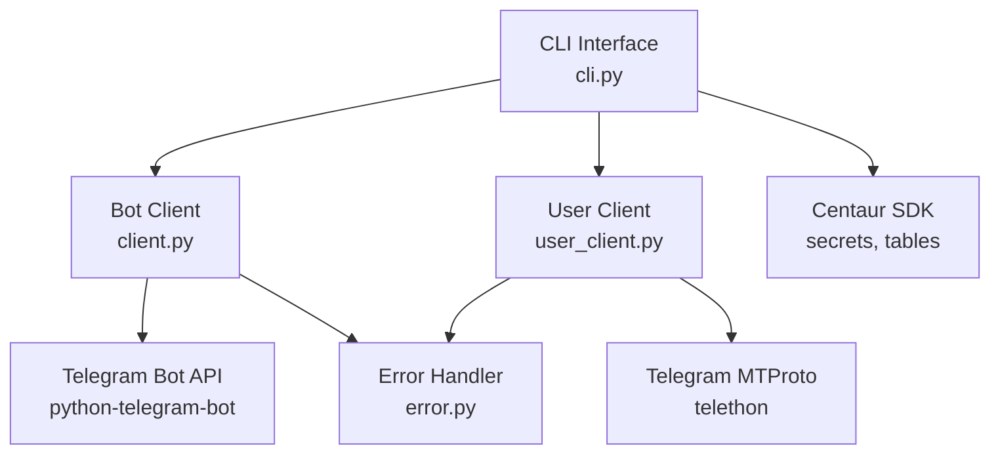
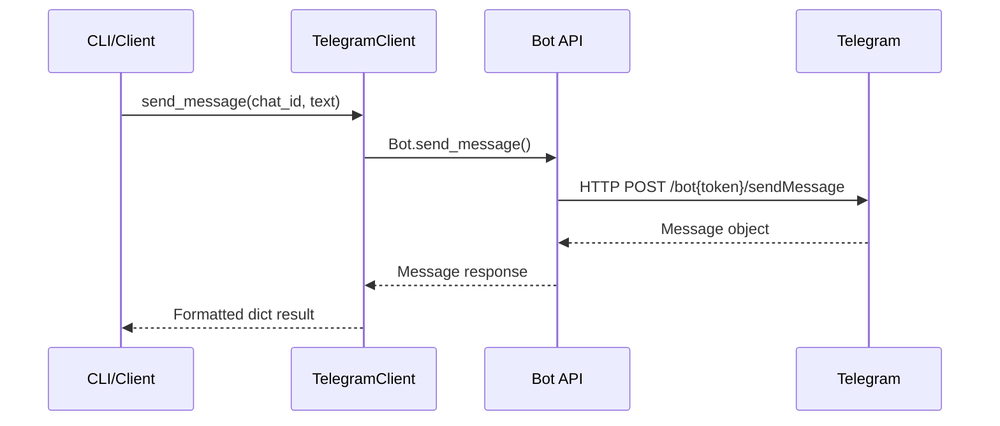
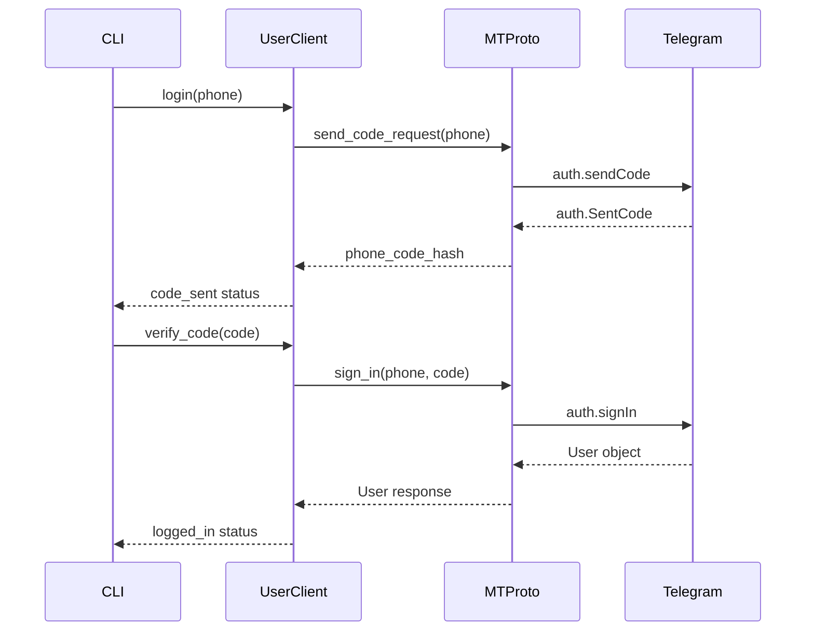

# Telegram Component Analysis

## Overview

The Telegram component is a comprehensive Python library that provides AI agents with full-featured Telegram communication capabilities. It offers dual-mode operation supporting both Bot API (for automated responses) and MTProto/user API (for direct user account access), enabling rich messaging, chat management, and context gathering functionality.

## Architecture

The component follows a **layered architecture** with clear separation between client implementations, CLI interface, and error handling. The architecture supports two distinct operational modes:

1. **Bot Mode**: Uses the official Telegram Bot API via `python-telegram-bot` for automated messaging
2. **User Mode**: Uses MTProto via `Telethon` for user account operations with access to full chat history

The design emphasizes async/await patterns throughout with synchronous wrapper functions for convenience, making it suitable for both interactive CLI usage and programmatic integration.



## Key Components

### 1. TelegramClient (client.py)
**Purpose**: High-level Bot API wrapper for automated messaging operations  
**Key Methods**: `send_message()`, `get_updates()`, `get_chat()`, `forward_message()`, `set_webhook()`  
**Authentication**: Uses `TELEGRAM_BOT_TOKEN` from environment via Centaur SDK secrets  
**Usage Pattern**: Async-first with context manager pattern for proper connection handling

### 2. UserClient (user_client.py)  
**Purpose**: MTProto client for user account access and full Telegram functionality  
**Key Methods**: `login()`, `get_messages()`, `get_dialogs()`, `search_messages()`, `send_message()`  
**Authentication**: Requires `TELEGRAM_API_ID`, `TELEGRAM_API_HASH`, and interactive login flow  
**Session Management**: Persistent sessions stored in `~/.config/telegram/session`

### 3. CLI Interface (cli.py)
**Purpose**: Comprehensive command-line interface exposing all client functionality  
**Bot Commands**: `send`, `updates`, `chat`, `me`, `forward`, `delete`, `webhook`  
**User Commands**: `login`, `whoami`, `dialogs`, `history`  
**Features**: Rich terminal output, JSON output mode, watch mode for live updates, search capabilities

### 4. Error Handling (error.py)
**Purpose**: Custom exception hierarchy for Telegram-specific errors  
**Implementation**: Simple base `TelegramError` class for unified error handling across clients

### 5. Async Utilities
**Purpose**: Helper functions for sync/async interoperability  
**Key Functions**: `run_async()` decorator, sync wrapper functions (`send_message()`, `get_updates()`, `get_chat()`)  
**Pattern**: Enables both async library usage and synchronous CLI operations

## Data Flows

### Bot Message Flow


### User Authentication Flow


### Message History Retrieval
```mermaid
flowchart TD
    A[history command] --> B{User authenticated?}
    B -->|No| C[Error: Run login first]
    B -->|Yes| D[UserClient.get_messages()]
    D --> E[Telethon iter_messages()]
    E --> F[Format message data]
    F --> G{JSON output?}
    G -->|Yes| H[Print JSON]
    G -->|No| I[Rich console display]
```

## External Dependencies

### Runtime Dependencies

- **python-telegram-bot** (>=21.0) [messaging]: Official Telegram Bot API wrapper providing high-level async interface. Used in `client.py` for all bot operations including message sending, updates polling, and webhook management. Core dependency for Bot API functionality.

- **telethon** (>=1.36.0) [messaging]: MTProto client library for accessing Telegram as a user account. Used in `user_client.py` for authentication, message history retrieval, chat management, and search operations. Enables full Telegram API access beyond bot limitations.

- **typer** (>=0.12.0) [cli]: Modern CLI framework with automatic help generation and type validation. Used throughout `cli.py` for command parsing, argument validation, and interactive prompts. Provides the entire command-line interface structure.

- **rich** (>=13.0.0) [cli]: Terminal formatting and display library for enhanced CLI output. Used in `cli.py` for colored output, tables, progress indicators, and rich text formatting. Improves user experience with formatted displays.

- **python-dotenv** (>=1.0.0) [configuration]: Environment variable loader for development workflows. Used in `cli.py` to automatically load `.env` files for local development and testing.

### Development Dependencies

The component uses hatchling as the build backend for packaging and distribution.

## API Surface

### Bot API Operations
```python
# Synchronous convenience functions
send_message(chat_id: int | str, text: str, **kwargs) -> dict
get_updates(limit: int = 100, **kwargs) -> list[dict]  
get_chat(chat_id: int | str) -> dict

# Async client methods
async def send_message(chat_id, text, parse_mode=None, reply_to_message_id=None)
async def get_updates(limit=100, timeout=0, offset=None)  
async def forward_message(chat_id, from_chat_id, message_id)
async def delete_message(chat_id, message_id)
async def set_webhook(url) / delete_webhook()
```

### User API Operations  
```python
async def login(phone: str) -> dict  # Start login flow
async def verify_code(phone, code, phone_code_hash) -> dict
async def get_messages(entity, limit=50, search=None) -> list[dict]
async def get_dialogs(limit=50) -> list[dict]  # List chats
async def send_message(entity, text, reply_to=None) -> dict
```

### CLI Commands
```bash
# Bot operations (requires TELEGRAM_BOT_TOKEN)
telegram send @username "Hello world" --markdown
telegram updates --watch --full
telegram chat @channel_name  
telegram webhook https://mybot.example.com/webhook

# User operations (requires API credentials + login)  
telegram login +1234567890
telegram history @channel --search "keyword" --limit 100
telegram dialogs --json
```

## External Systems

- **Telegram Bot API** (api.telegram.org): RESTful HTTP API for bot operations, webhook management, and message delivery. Requires bot token authentication.

- **Telegram MTProto** (telegram.org): Binary protocol for direct Telegram client access, enabling full user account functionality including private chat access and advanced features.

- **Centaur SDK**: Internal dependency providing secret management (`secret()` function) and UI components (`Table` class) for consistent integration with the Centaur platform.

## Component Interactions

This component has no direct interactions with other components in the codebase. It operates as a standalone library that other components can import and use for Telegram communication needs. The integration happens through:

- **Centaur SDK**: Uses `secret()` for secure credential management and `Table` for consistent CLI output formatting
- **Environment**: Expects secrets to be managed by the Centaur platform's secret management system
