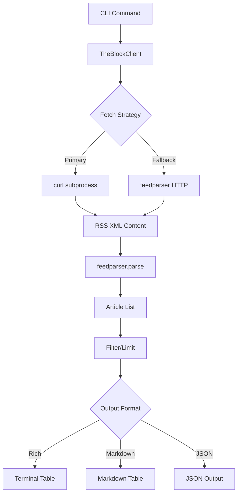

Now I have a comprehensive understanding of the theblock component. Let me write the analysis.

# The Block Component Analysis

## Overview

The `theblock` component is a Python library that provides a command-line interface for accessing cryptocurrency news from The Block's RSS feed. It offers a simple yet robust way to fetch and display the latest crypto news articles with multiple output formats including rich terminal tables, markdown, and JSON.

## Architecture

The component follows a simple layered architecture pattern with clear separation of concerns:

- **CLI Layer** (`cli.py`): Handles user interaction, command parsing, and output formatting
- **Client Layer** (`client.py`): Manages RSS feed fetching, parsing, and data transformation
- **Data Layer**: RSS feed parsing and article data structures

The architecture emphasizes simplicity and reliability, using subprocess calls to `curl` as a fallback when direct HTTP requests might be blocked, demonstrating a pragmatic approach to web scraping resilience.

## Key Components

### 1. TheBlockClient Class (`client.py`)
The core client responsible for fetching and parsing The Block's RSS feed. It implements a dual-fetch strategy using both `curl` subprocess calls and direct HTTP requests via `feedparser` for maximum compatibility.

### 2. CLI Application (`cli.py`)
Built on Typer framework, providing two main commands:
- `news`: Fetches latest articles with configurable limit
- `search`: Searches articles by keyword in title and summary

### 3. Output Formatters
Multiple output formats supported:
- Rich terminal tables with color coding and column sizing
- Markdown tables for documentation
- JSON output for programmatic consumption

### 4. Utility Functions
- `truncate()`: Text truncation for display formatting
- `print_markdown_table()`: Markdown table generation
- `get_client()`: Client factory function

### 5. Feed Parser Integration
Uses `feedparser` library to parse RSS XML into structured article data with fields: title, link, published date, summary, and author.

## Data Flows

The component implements a straightforward data flow pipeline:

### News Command Flow
1. User invokes `theblock news` with optional parameters
2. CLI creates TheBlockClient instance
3. Client fetches RSS feed from The Block
4. Feed content is parsed into article dictionaries
5. Articles are limited to requested count
6. Output is formatted according to user preference

### Search Command Flow
1. User provides search query and optional parameters
2. Full article list is fetched and parsed
3. Articles are filtered by query matching in title/summary
4. Filtered results are limited and formatted for output

## External Dependencies

### External Libraries

- **feedparser** (>=6.0.0) [xml-parsing]: Universal RSS/Atom feed parser library. Handles XML parsing, content extraction, and provides fallback HTTP client capabilities. Used in `client.py` for parsing The Block's RSS feed and as backup HTTP client when curl fails. Imported in: `client.py`.

- **typer** (>=0.12.0) [cli]: Modern Python CLI framework built on Click. Provides command decoration, argument parsing, help generation, and type validation. Powers the entire CLI interface with two main commands (`news` and `search`). Imported in: `cli.py`.

- **rich** (>=13.0.0) [terminal-ui]: Advanced terminal formatting library providing colored output, tables, and rich text rendering. Used for creating formatted terminal tables with color-coded columns and styling. Imported in: `cli.py` for Console and Table classes.

- **python-dotenv** (>=1.0.0) [configuration]: Environment variable loader that reads `.env` files. Loaded at CLI startup to handle any environment-based configuration, though no specific environment variables are currently used. Imported in: `cli.py`.

## API Surface

As a library component, theblock exposes the following public interfaces:

### CLI Commands
- `theblock news [--limit N] [--json] [--markdown]`: Fetch latest crypto news
- `theblock search QUERY [--limit N] [--json] [--markdown]`: Search news by keyword

### Python API
- `TheBlockClient`: Main client class for programmatic access
  - `news(limit: int = 20) -> list[dict]`: Get latest articles
  - `search(query: str, limit: int = 20) -> list[dict]`: Search articles
- Article data structure: `{"title", "link", "published", "summary", "author"}`

### Configuration
- Configurable timeout via `TheBlockClient(timeout=30.0)`
- User-Agent spoofing for bot detection avoidance
- RSS feed URL: `https://www.theblock.co/rss.xml`

## External Systems

The component connects to a single external system:

- **The Block RSS Feed** (`www.theblock.co`): Fetches cryptocurrency news articles via RSS XML feed. Uses HTTP GET requests with User-Agent spoofing to avoid bot detection. No authentication required.
