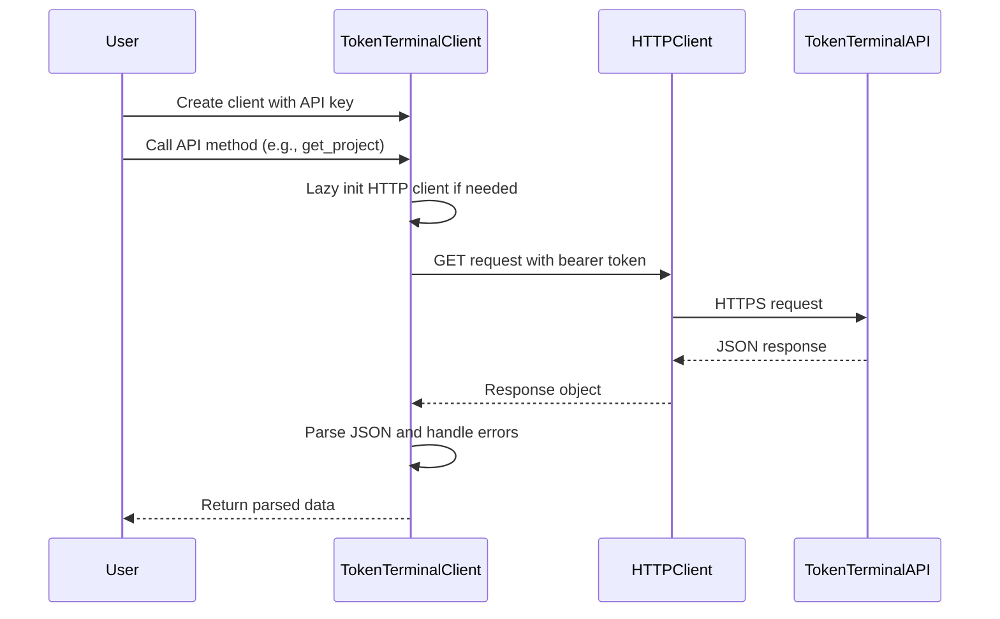

# Token Terminal Library

The token-terminal component is a Python library that provides a client interface to the Token Terminal API, which aggregates protocol revenue, fees, financial statements, and metrics for decentralized finance (DeFi) protocols and blockchain projects. This library serves as a structured wrapper around the Token Terminal REST API, offering programmatic access to crypto protocol financial data.

## Architecture

The component follows a simple client-server architecture pattern with a single-class design. The `TokenTerminalClient` class serves as the primary interface, implementing a RESTful API client pattern with lazy initialization of the HTTP client. The architecture is straightforward and focused, providing a clean abstraction over HTTP requests with proper error handling and resource management through context manager support.

The library uses dependency injection for API key management through the centaur SDK's secret management system, allowing for secure credential handling across different deployment environments.

## Key Components

### TokenTerminalClient Class
The core client class located in `client.py` that provides all API interaction capabilities. It implements lazy initialization for the HTTP client and uses bearer token authentication. The class includes proper resource management through context manager protocol implementation.

### API Request Handler
The `_request` method serves as the central HTTP request dispatcher, handling URL construction, authentication headers, error handling, and response parsing. It provides consistent error handling across all API operations, converting HTTP and network errors into runtime exceptions.

### Projects API Methods
A collection of methods (`list_projects`, `get_project`, `get_project_metrics`, `get_financial_statement`) that provide access to individual protocol data including revenue, fees, TVL (Total Value Locked), and financial statements with various time intervals.

### Market Sectors API Methods
Methods (`list_market_sectors`, `get_market_sector_metrics`) that provide access to aggregated market sector data, allowing analysis of entire categories of protocols rather than individual projects.

### Client Factory Function
The `_client` function serves as a factory that creates configured client instances using environment-based API key management through the centaur SDK's secret system.

## Data Flows

The primary data flow involves initialization with an API key, lazy creation of the HTTP client, and synchronous request-response cycles to the Token Terminal API. All requests use bearer token authentication and return JSON data that is parsed and returned as Python dictionaries or lists.

## External Dependencies

### Runtime Dependencies

- **httpx** (>=0.27.0) [networking]: Modern HTTP client library for Python providing sync/async capabilities. Used as the core HTTP client for all API requests to Token Terminal. Imported and used throughout the `TokenTerminalClient` class for making REST API calls with proper timeout handling and connection management.

- **typer** (>=0.12.0) [cli]: Modern CLI framework for Python based on type hints. While not directly used in the current client code, it's included in dependencies suggesting future CLI interface development for the library.

- **rich** (>=13.0.0) [cli]: Library for rich text and beautiful formatting in the terminal. Similar to typer, this suggests planned CLI functionality that would provide formatted output for terminal usage.

- **python-dotenv** (>=1.0.0) [configuration]: Library for loading environment variables from `.env` files. Not directly imported in the current code but supports the secret management pattern used by the centaur SDK.

### Internal Dependencies

- **centaur_sdk** [internal]: The centaur SDK provides the `secret` function used for secure API key management. This creates a dependency on the centaur SDK's secret management system for credential handling.

## API Surface

The library exposes a clean, focused API surface through the `TokenTerminalClient` class:

### Initialization
- `TokenTerminalClient(api_key: str, timeout: float = 30.0)`: Create client instance with API credentials
- `_client()`: Factory function that creates client using environment-based API key

### Project Methods
- `list_projects(limit: int = 50) -> list[dict]`: List all available protocols
- `get_project(project_id: str) -> dict`: Get detailed information for a specific protocol
- `get_project_metrics(project_id: str, metric: str = "fees", interval: str = "daily", limit: int = 30) -> list[dict]`: Get time-series metrics for a protocol
- `get_financial_statement(project_id: str, interval: str = "quarterly") -> dict`: Get financial statements

### Market Sector Methods
- `list_market_sectors() -> list[dict]`: List all market sectors
- `get_market_sector_metrics(sector: str, metric: str = "fees", interval: str = "daily", limit: int = 30) -> list[dict]`: Get aggregated metrics by sector

### Resource Management
- `close()`: Explicitly close HTTP client
- Context manager support via `__enter__` and `__exit__` for automatic resource cleanup

The API surface is designed for both programmatic integration and potential CLI usage, with clear parameter types and comprehensive docstrings. All methods return either dictionaries or lists of dictionaries containing the JSON responses from the Token Terminal API.
