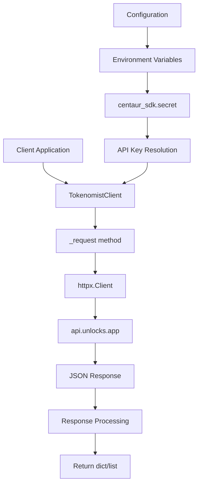

# Tokenomist Component Analysis

## Overview

The tokenomist component is a Python library that provides a client for interacting with the Tokenomist API service (api.unlocks.app), which specializes in token unlock schedules, vesting, emissions, and allocations data for cryptocurrency projects. This component serves as a lightweight wrapper around the external Tokenomist API, offering structured access to token economics data commonly needed for crypto research and analysis.

## Architecture

The component follows a **client-wrapper pattern**, providing a single cohesive interface to an external REST API. The architecture is straightforward and focused:

- **Single responsibility**: HTTP client wrapper for Tokenomist API
- **Simple abstraction**: Minimal transformation of API responses
- **Resource management**: Context manager support for proper connection handling
- **Error handling**: Wraps HTTP exceptions into runtime errors with meaningful messages

## Key Components

### TokenomistClient Class
**Location**: `tools/crypto/tokenomist/client.py` (lines 9-116)

The core class that encapsulates all API interactions. Features include:
- **Authentication**: API key-based authentication via headers
- **Connection management**: Lazy initialization of httpx.Client with configurable timeout
- **Context manager support**: Proper resource cleanup via `__enter__`/`__exit__`
- **Error handling**: Consistent exception wrapping for HTTP errors

### API Methods

1. **list_tokens()** (lines 46-59): Retrieves available tokens with pagination support
2. **get_allocations()** (lines 61-70): Fetches token allocation breakdowns  
3. **get_unlock_events()** (lines 72-81): Gets scheduled unlock events with timestamps
4. **get_daily_emissions()** (lines 83-92): Retrieves daily emission data
5. **get_fundraising()** (lines 94-103): Accesses fundraising rounds and investor data

### Private Methods

- **_request()** (lines 30-44): Core HTTP request handler with authentication headers
- **_client()** (lines 118-119): Factory function for creating client instances

## Data Flows

The data flow follows a simple request-response pattern:
1. Client instantiates TokenomistClient with optional API key
2. API key is resolved from environment via centaur_sdk.secret()
3. Method calls route through _request() with endpoint-specific parameters
4. HTTP requests made to api.unlocks.app with authentication headers
5. JSON responses returned directly with minimal processing

## External Dependencies

### External Libraries

- **httpx** (>=0.27.0) [networking]: Modern async-capable HTTP client library. Used for all API requests to the Tokenomist service. Provides better performance and async support compared to requests. Imported in: `client.py` line 4.

- **typer** (>=0.12.0) [cli]: Modern CLI framework for Python. Listed as dependency but not currently used in the codebase, likely planned for future CLI interface. Not imported in current implementation.

- **rich** (>=13.0.0) [cli]: Rich text and beautiful formatting library for terminal applications. Also listed but not used, likely for future CLI output formatting. Not imported in current implementation.

- **python-dotenv** (>=1.0.0) [build-tool]: Environment variable loading from .env files. Listed as dependency but not directly imported, may be used by the broader Centaur framework. Not imported in current implementation.

### Internal Dependencies

- **centaur_sdk** [internal]: Centaur framework SDK providing secret management functionality. Used via `secret()` function to resolve API keys from environment variables. Imported in: `client.py` line 6.

## API Surface

The component exposes a clean public interface through the TokenomistClient class:

### Public Methods
- `__init__(api_key: str | None, timeout: float)`: Initialize client with optional API key and timeout
- `list_tokens(limit: int) -> list[dict]`: List available tokens
- `get_allocations(token_id: str) -> dict | list`: Get allocation data for specific token
- `get_unlock_events(token_id: str) -> dict | list`: Get unlock schedule events
- `get_daily_emissions(token_id: str) -> dict | list`: Get daily emission data
- `get_fundraising(token_id: str) -> dict | list`: Get fundraising round information
- `close()`: Cleanup HTTP connections
- Context manager support via `__enter__`/`__exit__`

### Factory Function
- `_client() -> TokenomistClient`: Convenience factory for creating client instances

The API is designed for simplicity and consistency, with all data methods returning either dict or list depending on the API response structure.

## Configuration

The component requires a single configuration parameter:
- **TOKENOMIST_API_KEY**: Required environment variable for API authentication
- **timeout**: Optional timeout configuration (default 30.0 seconds)

Configuration is managed through the Centaur SDK's secret management system, providing a consistent approach to handling sensitive configuration data.
