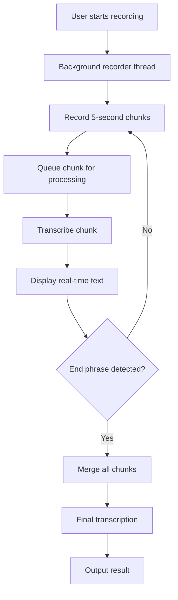
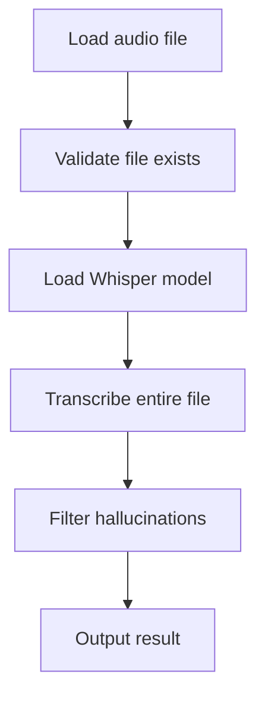
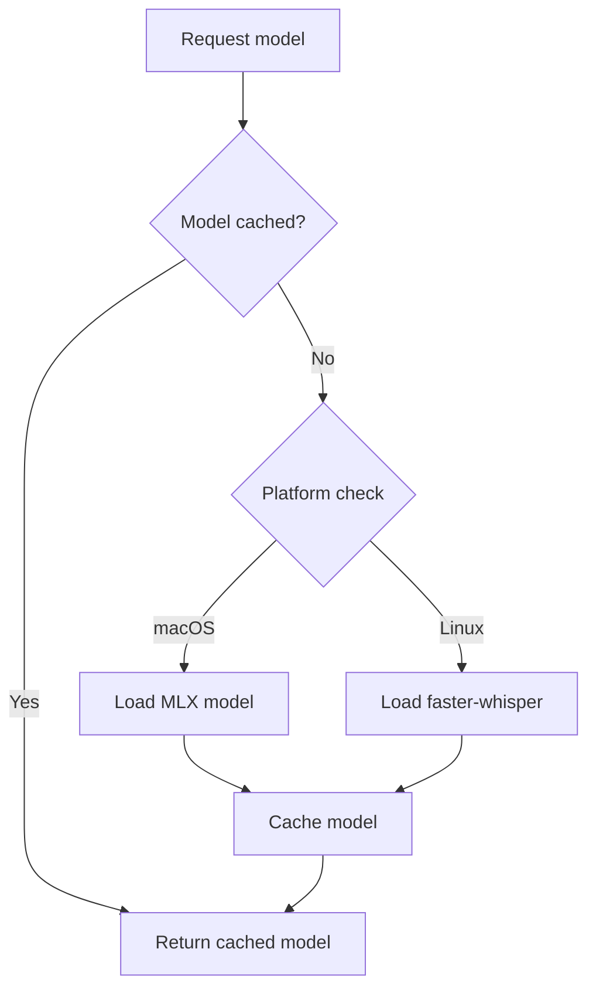

# Transcriber Component Analysis

The transcriber component is a sophisticated local-first voice transcription library that provides CLI functionality for real-time audio recording and transcription using OpenAI's Whisper models. It implements a streaming architecture with platform-specific optimizations for both macOS (using MLX) and Linux (using faster-whisper) backends.

## Architecture

The component follows a **layered architecture** with clear separation of concerns:

1. **CLI Layer**: Handles user interaction, command parsing, and output formatting using Typer and Rich
2. **Client Layer**: Manages Whisper model operations, audio recording, and transcription logic
3. **Platform Abstraction**: Provides cross-platform compatibility for audio recording and model backends

The design emphasizes local processing without external API dependencies, making it suitable for privacy-sensitive use cases.

## Key Components

### TranscriberClient (client.py)
The core transcription engine that manages Whisper model lifecycle and audio processing. It implements platform-specific model selection (MLX for macOS, faster-whisper for Linux) and handles model caching for performance optimization. The client provides unified interfaces for recording audio chunks and transcribing them while filtering out common Whisper hallucinations.

### CLI Commands (cli.py)
Four main command interfaces provide different usage modes:
- **record**: Live streaming transcription with real-time feedback
- **file**: Batch transcription of existing audio files  
- **listen**: Continuous listening mode for repeated recordings
- **models**: List available Whisper model variants

### Audio Recording System
Cross-platform audio capture using multiple backends (sox, ffmpeg, arecord) with automatic fallback detection. The system records 16kHz mono audio optimized for Whisper input requirements.

### Streaming Architecture
Implements background recording threads with chunk-based processing, allowing real-time transcription while continuing to record new audio. Uses queue-based communication between recording and transcription threads.

### Model Management
Intelligent caching system that maintains loaded Whisper models in memory across transcriptions. Platform-specific model selection chooses MLX-optimized models on macOS and standard faster-whisper models on Linux.

### Hallucination Filtering
Built-in detection and filtering of common Whisper hallucinations like "thank you", "subscribe", and other artifacts that commonly appear in silent audio or low-quality recordings.

## Data Flows

### Live Recording Flow


### File Processing Flow


### Model Loading Flow


## External Dependencies

### Core Dependencies

- **typer** (>=0.12.0) [cli]: Modern CLI framework providing command parsing, type validation, and help generation. Used throughout cli.py for defining commands, arguments, and options with rich type annotations.
- **rich** (>=13.0.0) [cli]: Terminal formatting and display library providing styled console output, progress indicators, and panels. Used in cli.py for status displays, panels, and colored output formatting.

### Optional Platform Dependencies

- **python-dotenv** [configuration]: Environment variable loading from .env files. Imported and used in cli.py for loading configuration, though not declared in pyproject.toml dependencies.
- **mlx-whisper** [ai-model] (macOS only): Apple Silicon optimized Whisper implementation. Dynamically imported in client.py when running on macOS for hardware-accelerated transcription.
- **faster-whisper** [ai-model] (Linux/other): CPU/CUDA optimized Whisper implementation. Dynamically imported in client.py on non-macOS platforms for efficient transcription.

### System Dependencies

The component requires external system tools for audio recording:
- **sox/rec**: Preferred audio recording backend with simple command interface
- **ffmpeg**: Fallback audio recording and processing with cross-platform support  
- **arecord**: Additional fallback for basic ALSA recording on Linux
- **pbcopy/xclip**: System clipboard integration for copying transcription results

## API Surface

### Library Interface

The component exposes a clean programmatic API through `TranscriberClient`:

```python
client = TranscriberClient()
# File transcription
text = client.transcribe_file(path, model="turbo", language="en")
# Model management
models = client.list_models()
# Audio recording
client.record_chunk(output_path, duration=5.0)
```

### CLI Interface

Four main commands provide comprehensive transcription functionality:

- `record [options]`: Live recording with streaming transcription
- `file <path> [options]`: Transcribe existing audio files
- `listen [options]`: Continuous listening mode for repeated use
- `models`: Display available Whisper model information

All commands support model selection (`-m/--model`), language specification (`-l/--language`), and output file saving (`-o/--output`).

### Configuration Options

- Model variants: tiny, base, small, medium, large, turbo (default)
- Audio parameters: 16kHz sample rate, mono channel, 16-bit PCM
- Streaming: Configurable chunk size (default 5 seconds)
- End phrase detection: "over and out" to stop recording
- Platform optimization: Automatic backend selection based on OS
