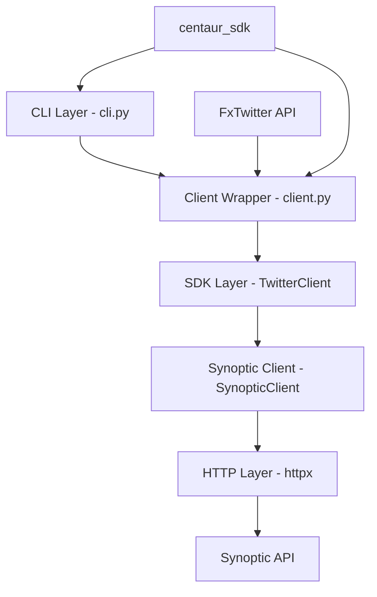
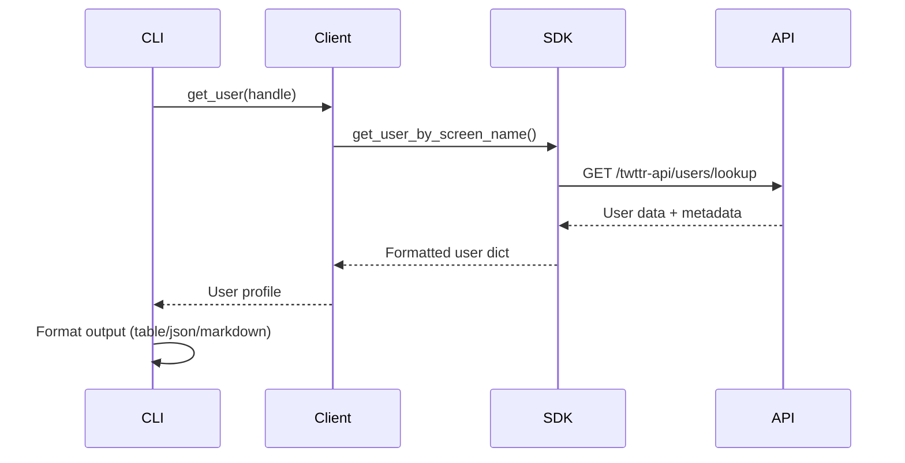
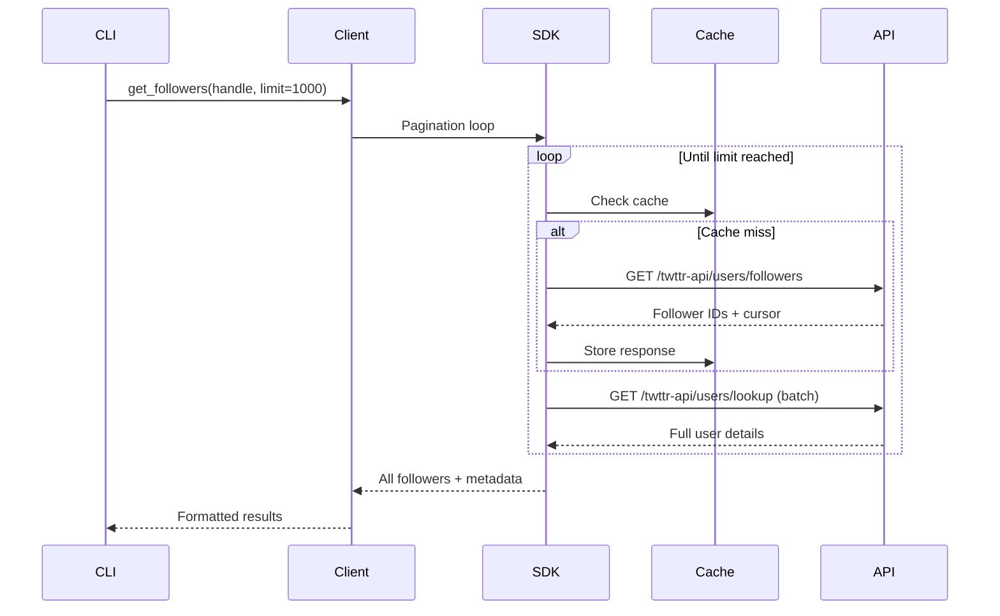
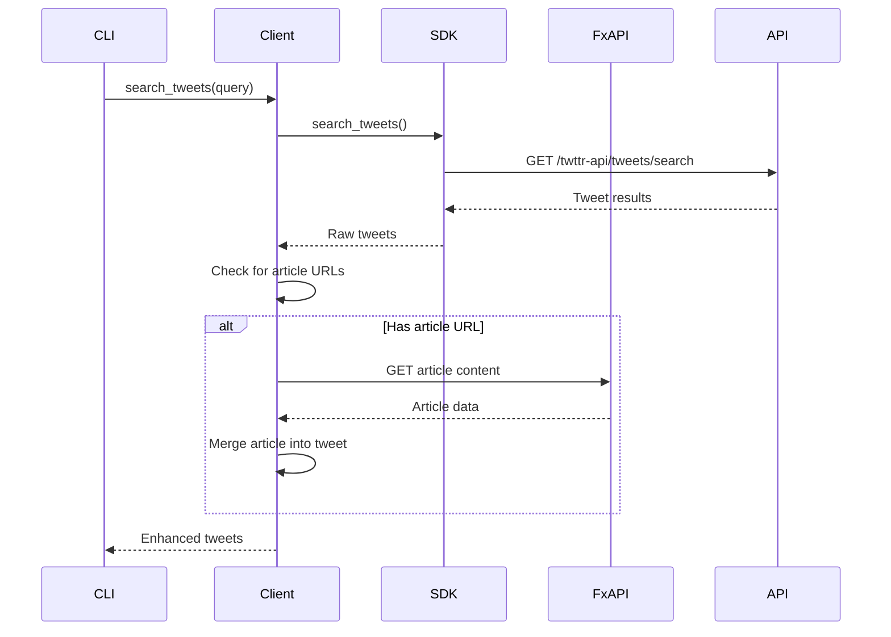

Now I have a comprehensive understanding of the Twitter component. Let me write the analysis:

# Twitter Component Analysis

The Twitter component is a comprehensive Python library that provides a CLI and SDK for interacting with Twitter/X data through the Synoptic API. It offers user profile management, follower/following analysis, tweet search capabilities, and timeline access with rich output formatting options.

## Architecture

The component follows a **layered architecture** pattern with clear separation between CLI presentation, client abstraction, and API communication layers. The design emphasizes async/await patterns for efficient HTTP operations while providing synchronous wrappers for CLI usage.



The architecture includes three distinct layers:
1. **CLI Layer**: Typer-based command interface with rich formatting
2. **Client Layer**: Sync wrapper with article expansion and caching
3. **SDK Layer**: Async HTTP client with retry logic and budget management

## Key Components

### CLI Interface (cli.py)
The main CLI application built with Typer, providing 8 commands for Twitter data access. Includes comprehensive output formatting with JSON, Markdown, and rich table options. Key features include number formatting (K/M suffixes), timestamp conversion, and metadata display for API usage tracking.

### Synchronous Client Wrapper (client.py) 
A sync wrapper (`PTwitterClient`) that bridges the async SDK with CLI usage. Handles article expansion for X long-form posts via FxTwitter API integration. Provides pagination management and automatic connection pooling through the embedded SDK.

### Async Twitter SDK (sdk/clients/twitter.py)
Main SDK class that inherits from `SynopticClient`. Acts as a future-proof abstraction layer that can accommodate additional Twitter API providers while currently delegating all operations to the Synoptic backend.

### Synoptic API Client (sdk/clients/synoptic.py)
Core async HTTP client with sophisticated retry logic, TTL caching, and budget management. Implements exponential backoff for rate limiting and connection errors. Features request batching for user/tweet lookups and comprehensive usage tracking.

### Configuration Management (sdk/config.py)
Pydantic-based settings management supporting environment variables and .env files. Handles API credentials, retry configuration, and backward compatibility with legacy RapidAPI providers.

### Data Models (sdk/models.py)
Pydantic models defining API response structures for followers, following users, and provider enums. Ensures type safety and validation across the SDK.

### Exception Handling (sdk/exceptions.py)
Comprehensive exception hierarchy including retryable HTTP errors, rate limit handling, and authentication failures. Supports the retry logic in the HTTP client layer.

## Data Flows

### User Profile Lookup Flow


### Follower Pagination Flow


### Tweet Search with Article Expansion


## External Dependencies

### Runtime Dependencies

- **typer** (>=0.12.0) [cli]: Modern CLI framework with automatic help generation and type hints. Used throughout `cli.py` for command definitions, argument parsing, and option handling. Provides the main `@app.command()` decorators and `typer.Typer` application instance.

- **rich** (>=13.0.0) [cli]: Rich text and formatting library for beautiful terminal output. Used in `cli.py` for colored console output (`Console()`), table formatting (`Table`), and styled text rendering. Handles progress indicators and styled output across all commands.

- **httpx** (>=0.28.1) [networking]: Modern async HTTP client library. Used in `client.py` for FxTwitter API calls and throughout `sdk/clients/synoptic.py` as the core HTTP transport. Provides connection pooling, timeout handling, and async/await support.

- **tenacity** (>=8.0.0) [async-runtime]: Retry library with exponential backoff and sophisticated retry logic. Used in `sdk/clients/synoptic.py` for handling rate limits, network timeouts, and server errors. Provides `@retry` decorators and retry configuration management.

- **pydantic** (>=2.0.0) [serialization]: Data validation and settings management using Python type annotations. Used in `sdk/config.py` for `SDKSettings` class and `sdk/models.py` for API response models like `Follower`, `Following`, and provider enums.

- **pydantic-settings** (>=2.0.0) [serialization]: Pydantic extension for loading settings from environment variables and .env files. Used in `sdk/config.py` for automatic configuration loading with `BaseSettings` and `SettingsConfigDict`.

### Internal Dependencies

- **centaur_sdk** [centaur]: Internal SDK providing `secret()` function for secure credential management and `Table` class for consistent table formatting. Used in `client.py` for API key retrieval and `cli.py` for table rendering.

## API Surface

The library exposes both programmatic and command-line interfaces:

### CLI Commands
- **user**: Get user profile by handle with follower counts and verification status
- **followers**: List followers with pagination, supports IDs-only mode
- **following**: List accounts a user follows with full user details
- **lookup**: Batch user lookup by comma-separated IDs
- **search**: Tweet search with query operators and result type selection
- **tweets**: Tweet lookup by IDs with automatic article expansion
- **timeline**: User timeline retrieval with pagination support
- **usage**: API credit usage monitoring

### Programmatic API
```python
# Async SDK usage
async with TwitterClient(api_key="key") as client:
    user = await client.get_user_by_screen_name("elonmusk")
    followers, cursor, meta = await client.get_followers("elonmusk")
    tweets, cursor, meta = await client.search_tweets("bitcoin")

# Sync wrapper usage  
client = PTwitterClient()
user = client.get_user("elonmusk")
followers, meta = client.get_followers("elonmusk", limit=100)
```

### Output Formats
All CLI commands support multiple output formats:
- **Rich Tables**: Colored, formatted terminal tables with proper alignment
- **JSON**: Machine-readable structured output for integration
- **Markdown**: Human-readable format suitable for documentation

The API provides comprehensive metadata including consumed API units, remaining credits, returned item counts, and pricing information for usage monitoring and budget management.

## External Systems

### Synoptic Twitter API
Primary data source providing Twitter/X API access through a unified interface. The component makes authenticated requests to endpoints like `/twttr-api/users/lookup`, `/twttr-api/users/followers`, and `/twttr-api/tweets/search`. Handles rate limiting, pagination cursors, and usage tracking.

### FxTwitter API
Secondary service used for expanding X article content embedded in tweets. Makes unauthenticated requests to `https://api.fxtwitter.com/{username}/status/{tweet_id}` to retrieve long-form article text and metadata. Used for enhancing tweet lookup results.

## Component Interactions

This library component has no direct interactions with other components in the centaur codebase. It operates as a standalone tool that:

- Imports utility functions from `centaur_sdk` for credential management and UI components
- Can be invoked independently via CLI or imported as a Python library
- Designed for integration into larger workflows through its programmatic API

The component follows the centaur pattern of self-contained tools that can be composed into larger systems while maintaining clear boundaries and minimal coupling.
