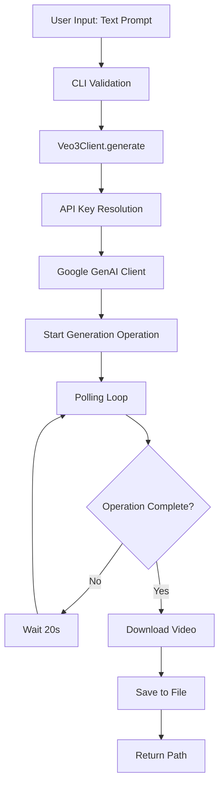
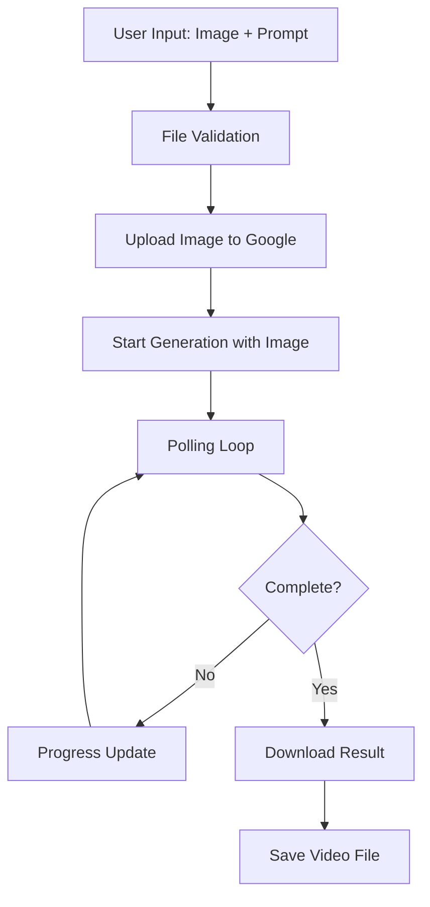
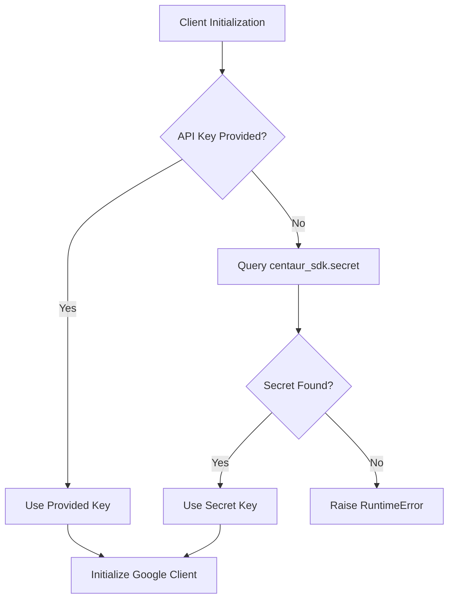

# Veo3 Component Analysis

## Architecture

The veo3 component follows a simple layered architecture with clear separation of concerns. It implements a **client-server wrapper pattern** that abstracts Google's Veo 3 video generation API behind a Python library with a CLI interface. The architecture consists of two primary layers:

1. **Core Client Layer** (`client.py`) - Handles API communication, authentication, and video generation operations
2. **CLI Interface Layer** (`cli.py`) - Provides user-friendly command-line interface using Typer framework

The component uses dependency injection for the Google API client and implements a polling-based asynchronous pattern for long-running video generation operations.

## Key Components

### Veo3Client
**Location**: `tools/media/veo3/client.py:13-287`
The core client class that wraps Google's generative AI API for video generation. Supports three main operations: text-to-video generation, image-to-video generation, and video extension. Uses lazy initialization for the Google API client and implements robust error handling with parameter validation.

### CLI Application (app)
**Location**: `tools/media/veo3/cli.py:10`
Main Typer application instance that defines the command-line interface. Provides four commands: `generate`, `from-image`, `extend`, and `models` with rich console output and progress indicators.

### generate Command
**Location**: `tools/media/veo3/cli.py:25-62`
Primary CLI command for text-to-video generation. Accepts text prompts and various configuration options (model type, aspect ratio, resolution) and generates videos using the underlying client.

### from-image Command
**Location**: `tools/media/veo3/cli.py:64-102`
CLI command for image-to-video generation where an input image serves as the first frame. Shares similar parameters with the generate command but additionally requires an image file path.

### extend Command
**Location**: `tools/media/veo3/cli.py:105-135`
CLI command for video extension functionality, allowing users to extend existing videos with additional content based on text prompts.

### Model Configuration
**Location**: `tools/media/veo3/client.py:19-25`
Static configuration defining available Veo models ("full" and "fast"), supported aspect ratios, and resolution options. Maps user-friendly names to Google API model identifiers.

### Authentication Handler
**Location**: `tools/media/veo3/client.py:36-43`
Secure API key management that integrates with the centaur_sdk secret management system, with fallback to environment variables.

### Progress Callback System
**Location**: `tools/media/veo3/cli.py:20-22`
Simple callback mechanism for providing user feedback during long-running video generation operations.

## Data Flows

### Text-to-Video Generation Flow

### Image-to-Video Generation Flow

### Authentication Flow

## External Dependencies

### Runtime Dependencies

- **google-genai** (>=1.0.0) [cloud-sdk]: Google's official generative AI Python SDK for accessing Veo 3 video generation APIs. Primary integration point for all video generation functionality. Used throughout `client.py` for API communication, file uploads, and operation polling.

- **typer** (>=0.12.0) [cli]: Modern CLI framework for building command-line applications with automatic help generation and type validation. Powers the entire CLI interface in `cli.py` with decorators for command definition and argument parsing.

- **rich** (>=13.0.0) [cli]: Advanced terminal formatting library providing colored output, progress indicators, and formatted tables. Used for console output, status indicators during video generation, and the models listing table display.

- **python-dotenv** (>=1.0.0) [build-tool]: Environment variable loader for development convenience. Automatically loads `.env` files at application startup to provide configuration without hardcoded secrets.

## API Surface

The veo3 component exposes both programmatic and command-line interfaces:

### Python API

**Veo3Client Class**:
- `__init__(api_key: str | None = None)` - Initialize client with optional API key
- `generate(prompt, output, model="full", aspect_ratio="16:9", resolution="720p", ...)` - Generate video from text
- `generate_from_image(image_path, prompt, output, ...)` - Generate video using image as first frame  
- `extend(video_path, prompt, output, model="full", ...)` - Extend existing video
- `list_models()` - Get available model information

### CLI Commands

**veo3 generate** - Text-to-video generation
- Arguments: `prompt` (required)
- Options: `--output`, `--model`, `--aspect-ratio`, `--resolution`

**veo3 from-image** - Image-to-video generation  
- Arguments: `image`, `prompt` (required)
- Options: `--output`, `--model`, `--aspect-ratio`, `--resolution`

**veo3 extend** - Video extension
- Arguments: `video`, `prompt` (required)
- Options: `--output`, `--model`

**veo3 models** - List available models
- No arguments, displays formatted table of model information

All commands support standard CLI patterns with `--help` documentation and exit code handling for automation integration.
