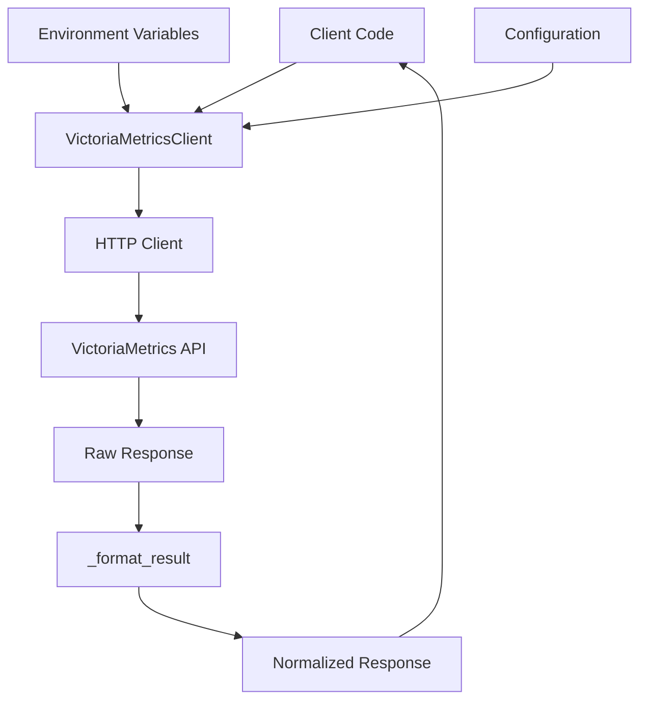

# VictoriaMetrics Client Library

## Architecture

The vmetrics component implements a clean client library architecture following the facade pattern. It provides a single unified interface (`VictoriaMetricsClient`) that wraps the VictoriaMetrics HTTP API, abstracting away the complexity of direct HTTP interactions and response formatting. The architecture is stateful with lazy initialization of the HTTP client and provides both synchronous query methods and context manager support for proper resource cleanup.

The component follows a simple layered design:
- **API Layer**: Public methods that expose VictoriaMetrics functionality
- **HTTP Layer**: HTTP client management using httpx
- **Response Processing Layer**: Result formatting and normalization
- **Configuration Layer**: URL and timeout management with environment variable support

## Key Components

### VictoriaMetricsClient Class
The main client class that provides all VictoriaMetrics interaction capabilities. It manages HTTP connections, handles configuration, and provides methods for instant queries, range queries, series discovery, and health checks. The client supports both explicit URL configuration and environment-based configuration via `VICTORIAMETRICS_URL`.

### Query Methods
- **query()**: Executes instant PromQL/MetricsQL queries for point-in-time data
- **query_range()**: Performs range queries over time periods with configurable step intervals
- **series()**: Discovers time series matching label selectors
- **label_values()**: Retrieves all values for specific labels
- **metric_names()**: Lists available metrics with optional prefix filtering

### HTTP Client Management
Lazy initialization of httpx.Client with automatic base URL construction and timeout configuration. The client property ensures a single HTTP client instance per VictoriaMetricsClient instance, supporting connection reuse and efficient resource management.

### Response Formatting
The `_format_result()` function transforms VictoriaMetrics API responses into a normalized format, extracting metric names, labels, and values into a consistent structure that's easier to work with than the raw Prometheus API format.

### Context Manager Support
Full context manager implementation with `__enter__` and `__exit__` methods for automatic resource cleanup, ensuring HTTP connections are properly closed when used in `with` statements.

### Health Checking
The `ready()` method provides a simple health check mechanism to verify VictoriaMetrics availability before executing queries, useful for readiness probes and error handling.

## Data Flows



### Query Flow
1. **Request Construction**: Client code calls query method with PromQL expression
2. **Parameter Preparation**: Method builds query parameters and optional time constraints
3. **HTTP Request**: httpx client sends GET request to appropriate VictoriaMetrics endpoint
4. **Response Processing**: Raw JSON response is parsed and validated
5. **Result Formatting**: `_format_result()` transforms response into normalized structure
6. **Return**: Formatted results returned to client code

### Connection Management Flow
1. **Lazy Initialization**: First API call triggers HTTP client creation
2. **Base URL Resolution**: URL determined from constructor parameter or environment variable
3. **Client Reuse**: Subsequent calls reuse the same HTTP client instance
4. **Resource Cleanup**: Context manager or explicit close() releases connections

## External Dependencies

### External Libraries

- **httpx** (>=0.27.0) [networking]: Modern async/sync HTTP client library for Python. Provides the underlying HTTP transport for all VictoriaMetrics API calls. Used throughout the `VictoriaMetricsClient` class for GET requests to query endpoints, with timeout and base URL configuration support. Imported in: `client.py` line 6.

## API Surface

### Public Classes

- **VictoriaMetricsClient**: Main client class for VictoriaMetrics interactions
  - Constructor parameters: `url` (optional), `timeout` (default 30.0s)
  - Context manager support for automatic resource cleanup
  - Environment variable configuration via `VICTORIAMETRICS_URL`

### Public Methods

- **query(expr, time=None)**: Instant PromQL/MetricsQL queries
- **query_range(expr, start, end=None, step="60s")**: Range queries with time bounds
- **series(match, start=None, end=None)**: Time series discovery
- **label_values(label)**: Label value enumeration
- **metric_names(prefix="agent_")**: Metric name listing with filtering
- **ready()**: Health check method
- **close()**: Explicit resource cleanup

### Response Format

All query methods return a standardized dictionary format:
```python
{
    "status": "success|error",
    "type": "vector|matrix|scalar",
    "results": [
        {
            "metric": "metric_name",
            "labels": {"key": "value"},
            "value": "numeric_value",
            "values": [[timestamp, value], ...]
        }
    ]
}
```

### Module Entry Point

The component provides a factory function `_client()` that returns a pre-configured VictoriaMetricsClient instance, though the primary usage pattern is direct class instantiation.
