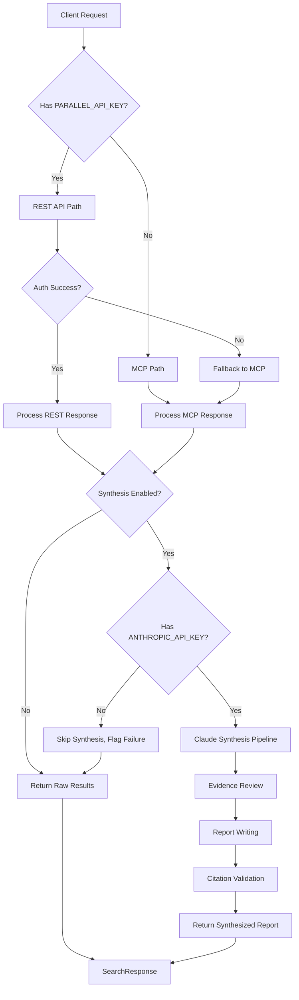
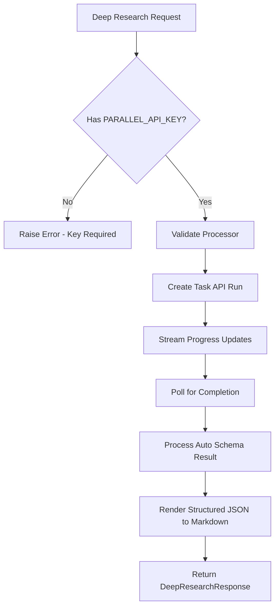
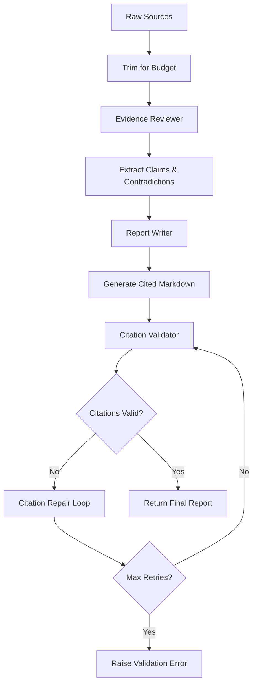

# Websearch Component Analysis

## Architecture

The websearch component implements a **layered architecture** with a **facade pattern** for abstracted web search capabilities. The component provides a unified interface that routes requests through multiple backend providers based on available credentials:

1. **Free MCP Path**: Anonymous access via Parallel's hosted Model Context Protocol server
2. **Paid REST Path**: Authenticated access via Parallel's REST API with advanced features  
3. **Synthesis Layer**: Optional Claude-powered report generation and citation validation

The architecture follows a **fallback pattern** where the client automatically downgrades from REST to MCP when authentication fails, ensuring graceful degradation. The component maintains **backward compatibility** with the original Exa-based tool while transitioning to Parallel Web Systems as the provider.

## Key Components

### 1. **WebSearchClient** (`client.py:66-262`)
The main facade class that orchestrates web search operations. Handles credential detection, backend routing, and optional synthesis pipeline integration. Provides two primary methods: `search()` for standard web search and `deep_research()` for comprehensive analysis.

### 2. **ParallelBackend** (`_parallel.py:112-871`)
Core backend implementation that manages interactions with Parallel's APIs. Handles both REST API calls via the official SDK and MCP protocol communication via raw HTTP. Implements request routing, error handling, and cost estimation.

### 3. **ClaudeSynthesisPipeline** (`client.py:264-504`)
Synthesis engine that processes raw search results through a three-stage pipeline: evidence review, report writing, and citation validation. Uses Anthropic's Claude API to generate structured, cited markdown reports from source documents.

### 4. **SourceDocument & Response Models** (`models.py:10-67`)
Pydantic data models defining the API contract. SourceDocument represents individual search results, while SearchResponse and DeepResearchResponse define output formats with metadata, attribution, and backward compatibility fields.

### 5. **CLI Interface** (`cli.py:16-187`)
Typer-based command-line interface providing `search` and `deep-research` commands. Includes pretty-printing modes, deprecation warnings for backward compatibility, and progress callbacks for long-running operations.

### 6. **System Prompts** (`prompts.py:1-69`)
Structured prompt templates for the Claude synthesis pipeline. Defines the reviewer, writer, and citation repair prompts with specific JSON schemas and behavioral constraints.

## Data Flows

### Search Request Flow

### Deep Research Flow

### Synthesis Pipeline Flow

## External Dependencies

### Runtime Dependencies

- **anthropic** (>=0.54.0) [ai-service]: Provides AsyncAnthropic client for Claude API integration. Used in ClaudeSynthesisPipeline for evidence review, report writing, and citation repair. Core to the synthesis feature when ANTHROPIC_API_KEY is configured. Imported in: `client.py:25`.

- **httpx** (>=0.28.0) [networking]: HTTP client library for async web requests. Used for direct MCP protocol communication with Parallel's search server when no API key is available. Handles JSON-RPC envelope construction and response parsing. Imported in: `_parallel.py:22`.

- **parallel-web** (>=0.6.0) [ai-service]: Official Parallel Web Systems Python SDK. Provides AsyncParallel client for REST API access to Search API and Task API. Enables authenticated access to advanced search features and deep research capabilities. Imported in: `_parallel.py:23`.

- **pydantic** (>=2.10.0) [serialization]: Data validation and serialization framework. Used to define all API response models (SourceDocument, SearchResponse, etc.) with type safety and validation. Provides model_dump() for JSON serialization. Imported in: `models.py:7`.

- **python-dotenv** (>=1.0.0) [configuration]: Environment variable loader for development. Used in CLI module to load .env files for credential configuration. Supports both root and component-local .env files. Imported in: `cli.py:9`.

- **rich** (>=13.0.0) [cli]: Terminal formatting library for enhanced console output. Used in CLI module to provide colored, formatted output for search results and status messages. Handles pretty-printing mode and progress indicators. Imported in: `cli.py:10`.

- **typer** (>=0.12.0) [cli]: Modern CLI framework built on Click. Provides the command-line interface with argument parsing, help generation, and option validation. Implements `search` and `deep-research` commands with comprehensive flag support. Imported in: `cli.py:8`.

### Internal Dependencies

- **centaur_sdk**: Framework-provided SDK for tool context and secret management. Used for credential detection and HTTP header injection via the StubBackend/firewall pattern. Critical for the `_is_configured()` routing logic. Imported in: `client.py:27`.

## API Surface

### Public Methods

**WebSearchClient.search()**
- **Purpose**: Primary web search interface supporting both free MCP and paid REST backends
- **Input**: Query string, optional filters (domains, recency), synthesis controls
- **Output**: SearchResponse dict with sources, optional synthesized answer, and metadata
- **Routing**: Automatically selects MCP (free) or REST (paid) based on PARALLEL_API_KEY availability

**WebSearchClient.deep_research()**
- **Purpose**: Comprehensive research using Parallel's Task API with structured output
- **Input**: Research question, processor selection (pro/ultra family), timeout controls
- **Output**: DeepResearchResponse dict with cited markdown report and source grounding
- **Requirements**: Requires PARALLEL_API_KEY; supports processor-specific timeout and cost estimation

### Configuration Surface

**Credential-Based Feature Gates**:
- No credentials: Free MCP search with basic excerpts
- PARALLEL_API_KEY: REST search with filters + deep research capability  
- ANTHROPIC_API_KEY: Adds Claude synthesis pipeline on top of search results

**Constructor Parameters**:
- API keys, base URLs, synthesis model selection, deep research processor defaults
- All parameters optional with sensible defaults for zero-config usage

### CLI Surface

**Commands**:
- `search <query>`: Web search with filtering options and pretty-printing
- `deep-research <question>`: Comprehensive research with processor selection
- Backward compatibility flags accepted but ignored with deprecation warnings
