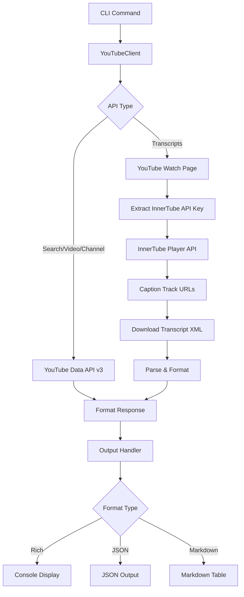
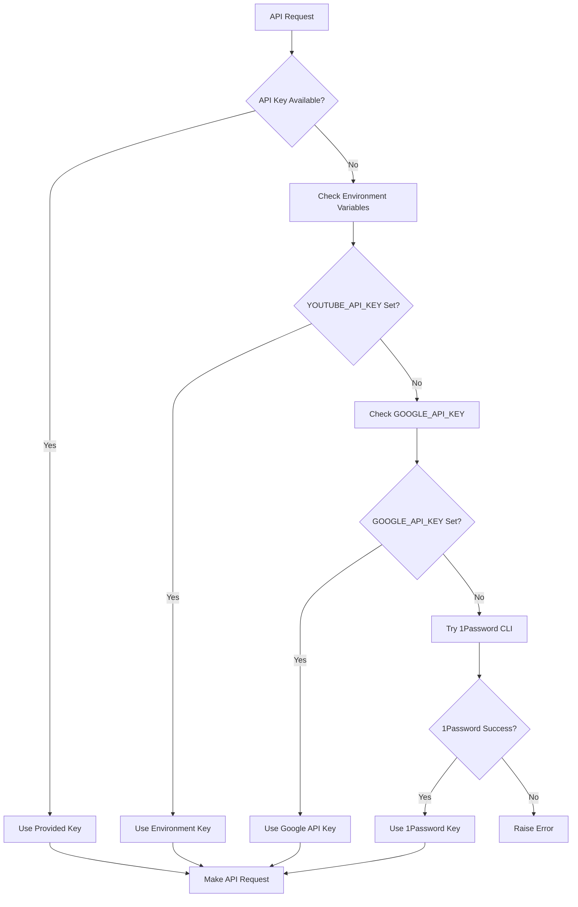

# YouTube Component Analysis

## Architecture

The YouTube component follows a **layered architecture** pattern with clear separation between the CLI interface, HTTP client, and data processing layers. The design emphasizes modularity with a single `YouTubeClient` class handling all API interactions, while the CLI module provides command-line interfaces for different YouTube operations.

The architecture supports dual data sources: the official YouTube Data API v3 for metadata and search operations, and YouTube's internal InnerTube API for transcript access. This hybrid approach enables comprehensive functionality while maintaining reliability through the use of official APIs where available.

## Key Components

### YouTubeClient (client.py)
The core client class that handles all YouTube API interactions. It manages HTTP communication with both the YouTube Data API v3 and YouTube's internal transcript system. The client includes sophisticated URL normalization, consent wall handling, and automatic API key resolution through multiple sources (environment variables, 1Password CLI).

### CLI Commands (cli.py)
A Typer-based command-line interface providing five main commands: `search`, `video`, `channel`, `transcripts`, and `transcript`. Each command supports multiple output formats (rich console output, JSON, and Markdown) with intelligent formatting for human-readable displays.

### Transcript Processing System
A complex system for extracting and processing YouTube video transcripts, including XML parsing, time window slicing, and multi-language support. It handles both manual and auto-generated captions with fallback mechanisms for language selection.

### Data Formatting Utilities
Helper functions for presenting YouTube data in user-friendly formats, including number abbreviation (1.2M, 3.4K), duration parsing from ISO 8601 format, and timestamp formatting for transcript display.

### Authentication Management
Multi-layered authentication system that attempts to retrieve API keys from instance variables, environment variables (YOUTUBE_API_KEY, GOOGLE_API_KEY), and 1Password CLI as fallback options.

## Data Flows

### Authentication Flow

## External Dependencies

### Runtime Libraries

- **httpx** (>=0.27.0) [networking]: Modern HTTP client library used for all API requests to YouTube services. Provides async support, connection pooling, and robust error handling. Used throughout the YouTubeClient class for both Data API and transcript requests. Imported in: `tools/research/youtube/client.py`.

- **typer** (>=0.12.0) [cli]: Modern CLI framework built on Click that provides type-safe command-line interfaces with automatic help generation and validation. Powers all CLI commands including search, video, channel, and transcript operations. Imported in: `tools/research/youtube/cli.py`.

- **rich** (>=13.0.0) [cli]: Advanced terminal formatting library that provides colored output, tables, and progress bars. Used for creating formatted console output including tables for search results and styled text for video information. Imported in: `tools/research/youtube/cli.py`.

- **python-dotenv** (>=1.0.0) [configuration]: Loads environment variables from .env files for development convenience. Called at module import to automatically load API keys and configuration. Imported in: `tools/research/youtube/cli.py`.

### Internal Dependencies

- **centaur_sdk.secret**: Internal SDK function for retrieving secrets from various sources including environment variables and secret management systems. Used in the `_get_api_key` method to resolve YouTube API credentials. Imported in: `tools/research/youtube/client.py`.

## API Surface

### Public Classes

**YouTubeClient**: The main client class exposing methods for YouTube API interaction:
- `search(query, max_results, type, order)`: Search for videos, channels, or playlists
- `get_video(video_id)`: Retrieve detailed video information including statistics
- `get_channel(channel_id)`: Get channel details and statistics
- `list_transcripts(video_id)`: List available caption tracks for a video
- `get_transcript(video_id, language_codes, start_time, end_time)`: Download timestamped transcripts

### CLI Commands

**search**: Search YouTube content with filtering by type (video/channel/playlist) and customizable result limits
**video**: Get comprehensive video details including view counts, likes, and descriptions  
**channel**: Retrieve channel statistics and metadata
**transcripts**: List available caption tracks for any video
**transcript**: Download full transcripts with time-based slicing and language selection

### Data Formats

All methods return structured dictionaries matching YouTube's API response format, with additional computed fields for convenience. The CLI supports three output formats: rich console display with colors and tables, raw JSON for programmatic use, and Markdown tables for documentation.
